``` r
library(tidyverse)
```

    ## -- Attaching packages ----------------------------------------------------------------- tidyverse 1.3.0 --

    ## v ggplot2 3.3.2     v purrr   0.3.4
    ## v tibble  3.0.3     v dplyr   1.0.2
    ## v tidyr   1.1.2     v stringr 1.4.0
    ## v readr   1.3.1     v forcats 0.5.0

    ## -- Conflicts -------------------------------------------------------------------- tidyverse_conflicts() --
    ## x dplyr::filter() masks stats::filter()
    ## x dplyr::lag()    masks stats::lag()

``` r
library(car)
```

    ## Loading required package: carData

    ## 
    ## Attaching package: 'car'

    ## The following object is masked from 'package:dplyr':
    ## 
    ##     recode

    ## The following object is masked from 'package:purrr':
    ## 
    ##     some

``` r
library(ggplot2)
library(DataExplorer)
library(pastecs)
```

    ## 
    ## Attaching package: 'pastecs'

    ## The following objects are masked from 'package:dplyr':
    ## 
    ##     first, last

    ## The following object is masked from 'package:tidyr':
    ## 
    ##     extract

``` r
library(plyr)
```

    ## ------------------------------------------------------------------------------

    ## You have loaded plyr after dplyr - this is likely to cause problems.
    ## If you need functions from both plyr and dplyr, please load plyr first, then dplyr:
    ## library(plyr); library(dplyr)

    ## ------------------------------------------------------------------------------

    ## 
    ## Attaching package: 'plyr'

    ## The following objects are masked from 'package:dplyr':
    ## 
    ##     arrange, count, desc, failwith, id, mutate, rename, summarise,
    ##     summarize

    ## The following object is masked from 'package:purrr':
    ## 
    ##     compact

``` r
library(effects)
```

    ## Registered S3 methods overwritten by 'lme4':
    ##   method                          from
    ##   cooks.distance.influence.merMod car 
    ##   influence.merMod                car 
    ##   dfbeta.influence.merMod         car 
    ##   dfbetas.influence.merMod        car

    ## lattice theme set by effectsTheme()
    ## See ?effectsTheme for details.

``` r
library(tseries)
```

    ## Registered S3 method overwritten by 'quantmod':
    ##   method            from
    ##   as.zoo.data.frame zoo

``` r
library(AER)
```

    ## Loading required package: lmtest

    ## Loading required package: zoo

    ## 
    ## Attaching package: 'zoo'

    ## The following objects are masked from 'package:base':
    ## 
    ##     as.Date, as.Date.numeric

    ## Loading required package: sandwich

    ## Loading required package: survival

``` r
library(broom)
library(caret)
```

    ## Loading required package: lattice

    ## 
    ## Attaching package: 'caret'

    ## The following object is masked from 'package:survival':
    ## 
    ##     cluster

    ## The following object is masked from 'package:purrr':
    ## 
    ##     lift

``` r
library(mice)
```

    ## 
    ## Attaching package: 'mice'

    ## The following objects are masked from 'package:base':
    ## 
    ##     cbind, rbind

``` r
library(leaps)
```

Introduction
------------

To begin, I wanted to explore a dataset that is something I believe
might be relevant in a business setting. I found a dataset on Kaggle
about telco churn rate, which is a classic example of how to answer a
business problem.

``` r
## load dataset
telcodata <- read.table("C:/Users/Matt/Downloads/telco_customer_churn.csv", header=TRUE, sep = ",", stringsAsFactors = TRUE)

## convert remaining categorical columns to factors
telcodata$SeniorCitizen <- as.factor(telcodata$SeniorCitizen)

## Replace "No internet service" to "No" as they generally mean the same thing
telcodata[telcodata == "No internet service"] <- "No"

## Omitting NA for now to run Boruta Algorithm

telcodata_nona <- na.omit(telcodata)

str(telcodata_nona)
```

    ## 'data.frame':    7032 obs. of  21 variables:
    ##  $ customerID      : Factor w/ 7043 levels "0002-ORFBO","0003-MKNFE",..: 5376 3963 2565 5536 6512 6552 1003 4771 5605 4535 ...
    ##  $ gender          : Factor w/ 2 levels "Female","Male": 1 2 2 2 1 1 2 1 1 2 ...
    ##  $ SeniorCitizen   : Factor w/ 2 levels "0","1": 1 1 1 1 1 1 1 1 1 1 ...
    ##  $ Partner         : Factor w/ 2 levels "No","Yes": 2 1 1 1 1 1 1 1 2 1 ...
    ##  $ Dependents      : Factor w/ 2 levels "No","Yes": 1 1 1 1 1 1 2 1 1 2 ...
    ##  $ tenure          : int  1 34 2 45 2 8 22 10 28 62 ...
    ##  $ PhoneService    : Factor w/ 2 levels "No","Yes": 1 2 2 1 2 2 2 1 2 2 ...
    ##  $ MultipleLines   : Factor w/ 3 levels "No","No phone service",..: 2 1 1 2 1 3 3 2 3 1 ...
    ##  $ InternetService : Factor w/ 3 levels "DSL","Fiber optic",..: 1 1 1 1 2 2 2 1 2 1 ...
    ##  $ OnlineSecurity  : Factor w/ 3 levels "No","No internet service",..: 1 3 3 3 1 1 1 3 1 3 ...
    ##  $ OnlineBackup    : Factor w/ 3 levels "No","No internet service",..: 3 1 3 1 1 1 3 1 1 3 ...
    ##  $ DeviceProtection: Factor w/ 3 levels "No","No internet service",..: 1 3 1 3 1 3 1 1 3 1 ...
    ##  $ TechSupport     : Factor w/ 3 levels "No","No internet service",..: 1 1 1 3 1 1 1 1 3 1 ...
    ##  $ StreamingTV     : Factor w/ 3 levels "No","No internet service",..: 1 1 1 1 1 3 3 1 3 1 ...
    ##  $ StreamingMovies : Factor w/ 3 levels "No","No internet service",..: 1 1 1 1 1 3 1 1 3 1 ...
    ##  $ Contract        : Factor w/ 3 levels "Month-to-month",..: 1 2 1 2 1 1 1 1 1 2 ...
    ##  $ PaperlessBilling: Factor w/ 2 levels "No","Yes": 2 1 2 1 2 2 2 1 2 1 ...
    ##  $ PaymentMethod   : Factor w/ 4 levels "Bank transfer (automatic)",..: 3 4 4 1 3 3 2 4 3 1 ...
    ##  $ MonthlyCharges  : num  29.9 57 53.9 42.3 70.7 ...
    ##  $ TotalCharges    : num  29.9 1889.5 108.2 1840.8 151.7 ...
    ##  $ Churn           : Factor w/ 2 levels "No","Yes": 1 1 2 1 2 2 1 1 2 1 ...
    ##  - attr(*, "na.action")= 'omit' Named int [1:11] 489 754 937 1083 1341 3332 3827 4381 5219 6671 ...
    ##   ..- attr(*, "names")= chr [1:11] "489" "754" "937" "1083" ...

Problem 1
---------

Part a)
-------

``` r
## boruta algorithm to find best predictors
library(Boruta)
set.seed(123)
telcodata_boruta <- Boruta(Churn ~., data = telcodata_nona)
telcodata_boruta2 <- TentativeRoughFix(telcodata_boruta)
```

    ## Warning in TentativeRoughFix(telcodata_boruta): There are no Tentative
    ## attributes! Returning original object.

``` r
print(telcodata_boruta2)
```

    ## Boruta performed 28 iterations in 47.20566 secs.
    ##  18 attributes confirmed important: Contract, Dependents,
    ## DeviceProtection, InternetService, MonthlyCharges and 13 more;
    ##  2 attributes confirmed unimportant: customerID, gender;

``` r
## plot importance of each variable obtained from boruta 
plot(telcodata_boruta2, xlab = "", xaxt = "n")
lz<-lapply(1:ncol(telcodata_boruta2$ImpHistory),function(i)
telcodata_boruta2$ImpHistory[is.finite(telcodata_boruta2$ImpHistory[,i]),i])
names(lz) <- colnames(telcodata_boruta2$ImpHistory)
Labels <- sort(sapply(lz,median))
axis(side = 1,las=2,labels = names(Labels),
at = 1:ncol(telcodata_boruta2$ImpHistory), cex.axis = 0.7)
```

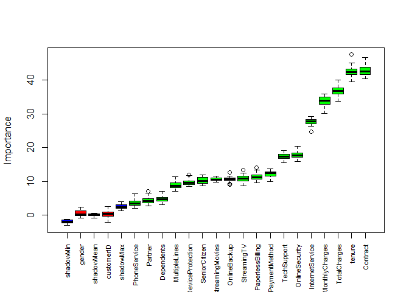

The top 10 predictors from the Boruta algorithm are; 1) tenure 2)
Contract 3) TotalCharges 4) MonthlyCharges 5) OnlineSecurity 6)
InternetService 7) TechSupport 8) OnlineBackup 9) DeviceProtection 10)
PaymentMethod

Part b)
-------

``` r
## Mallows Cp test for which terms to keep in model

ss = regsubsets(Churn ~ tenure + Contract + TotalCharges + MonthlyCharges + OnlineSecurity + InternetService + TechSupport + OnlineBackup + DeviceProtection + PaymentMethod, method=c("exhaustive"), nbest = 1, nvmax = 13, data = telcodata_nona)
```

    ## Warning in leaps.setup(x, y, wt = wt, nbest = nbest, nvmax = nvmax, force.in =
    ## force.in, : 4 linear dependencies found

    ## Reordering variables and trying again:

``` r
subsets(ss,min.size = 8, statistic="cp", legend=interactive())
```

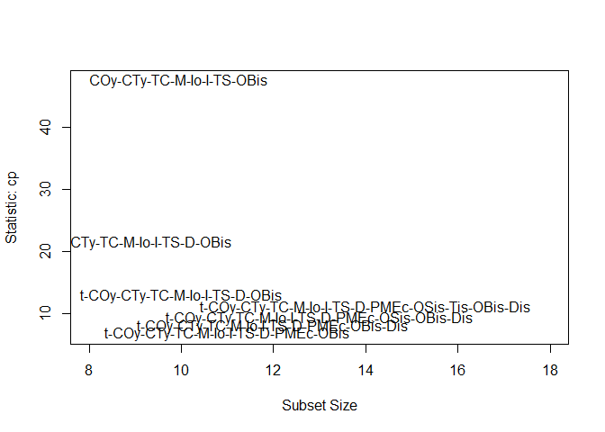

    ##                                      Abbreviation
    ## tenure                                          t
    ## ContractOne year                              COy
    ## ContractTwo year                              CTy
    ## TotalCharges                                   TC
    ## MonthlyCharges                                  M
    ## OnlineSecurityYes                              OS
    ## InternetServiceFiber optic                     Io
    ## InternetServiceNo                               I
    ## TechSupportYes                                 TS
    ## OnlineBackupYes                                OB
    ## DeviceProtectionYes                             D
    ## PaymentMethodCredit card (automatic)          Pc(
    ## PaymentMethodElectronic check                PMEc
    ## PaymentMethodMailed check                    PMMc
    ## OnlineSecurityNo internet service            OSis
    ## TechSupportNo internet service                Tis
    ## OnlineBackupNo internet service              OBis
    ## DeviceProtectionNo internet service           Dis

Keep all 10 top predictors obtained from Boruta Algorithm (no subset of
these 10 variables have a lower Mallows Cp)

Part c)
-------

I will work with the Top 7 predictors obtained in the Boruta algorithm;

1.  tenure
2.  Contract
3.  TotalCharges
4.  MonthlyCharges
5.  OnlineSecurity
6.  InternetService
7.  TechSupport

``` r
## keep variables desired
telcodata2 <- subset(telcodata, select = c("tenure", "Contract", "TotalCharges", "MonthlyCharges", "OnlineSecurity", "InternetService", "TechSupport", "Churn"))
```

Problem 2
---------

Part a)
-------

``` r
## Histogram
plot_histogram(telcodata2)
```

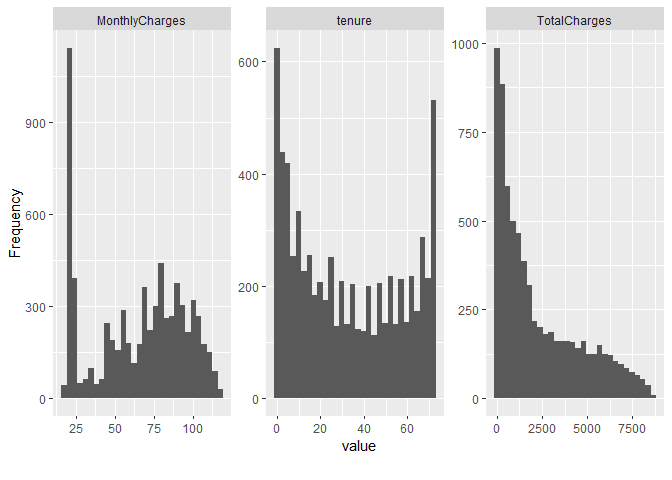

``` r
## QQ plot of model
plot_qq(telcodata2, ncol = 4)
```

    ## Warning: Removed 11 rows containing non-finite values (stat_qq).

    ## Warning: Removed 11 rows containing non-finite values (stat_qq_line).

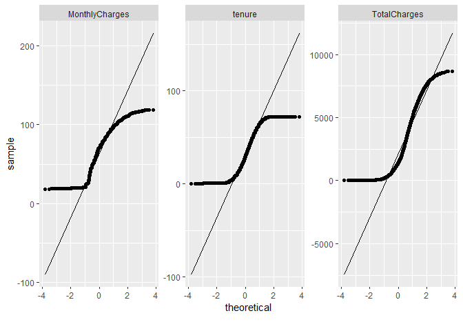

``` r
## correlation plot of variables

plot_correlation(telcodata2, geom_text_args = list(check_overlap = TRUE))
```

    ## Warning: Removed 28 rows containing missing values (geom_text).

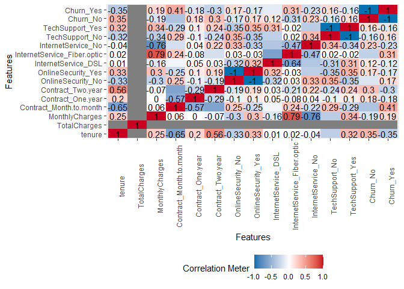

As expected, many of our categorical variables have collinearity since
some (like monthly and total charges) measure similar things and some
answer choices (no internet, and no) mean the same thing.

``` r
## boxplot of variables
plot_boxplot(telcodata2, by = "Churn")
```

    ## Warning: Removed 11 rows containing non-finite values (stat_boxplot).

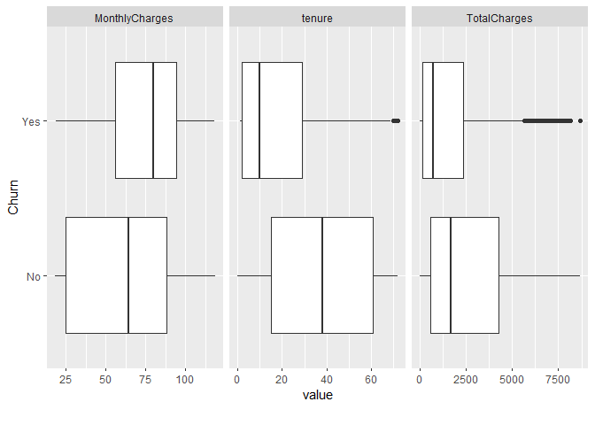

Just visually, we can see some interesting relationship between tenure
length and churn. Seems to me like a lower tenure may lead to higher
churn rate.

Part b)
-------

``` r
## density plot of variables
plot_density(telcodata2)
```

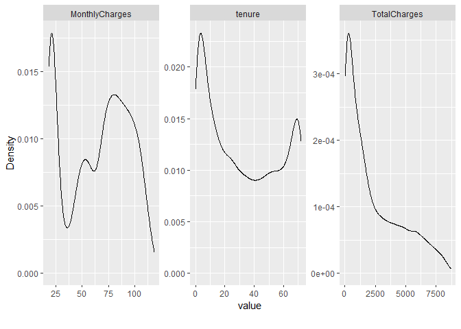

``` r
## barplot of categorical variables
plot_bar(telcodata2)
```

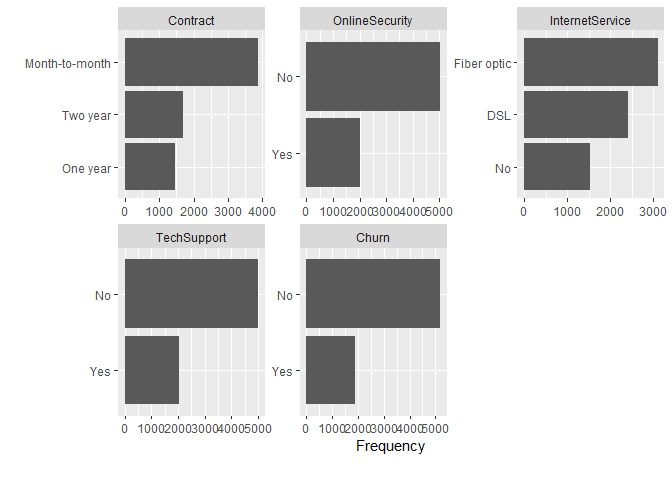

One thing I noticed was that TotalCharges seems to have some right skew.
In addition, this was when I realized that I was working with a binary
dependent variable.

Part c)
-------

``` r
###Using Box-Cox we can determine the best transformation for each non-indicator variable

## MonthlyCharges
symbox(telcodata2$MonthlyCharges, powers = c(-1,-.5,0,0.5,1))
```

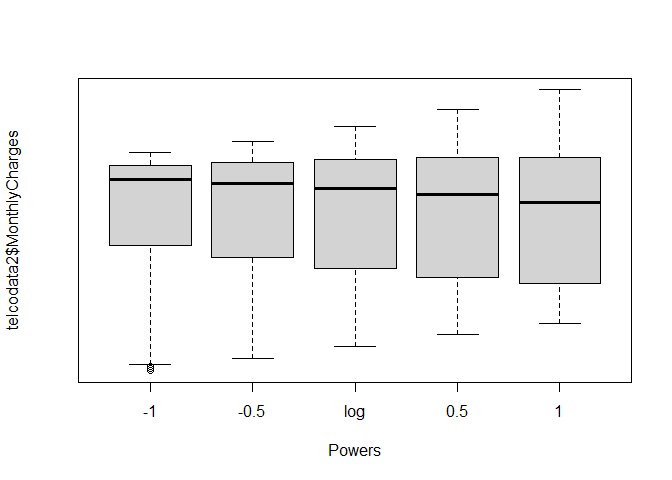

``` r
## tenure
symbox(telcodata2$tenure, powers = c(-1,-.5,0,0.5,1))
```

    ## Warning in symbox.default(telcodata2$tenure, powers = c(-1, -0.5, 0, 0.5, :
    ## start set to 0.72

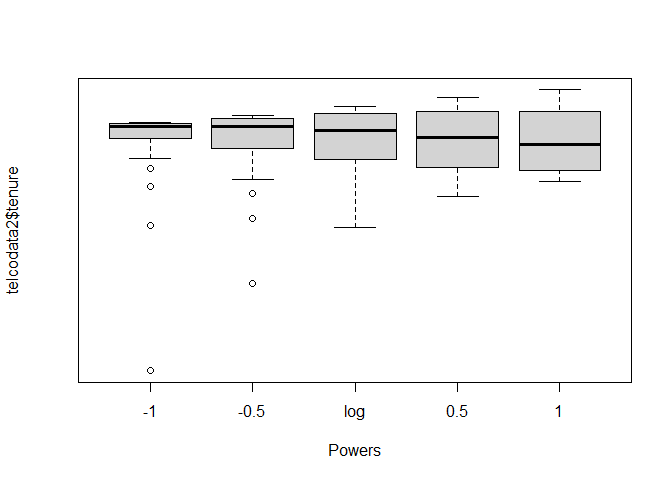

``` r
## TotalCharges
symbox(telcodata2$TotalCharges, powers = c(-1,-.5,0,0.5,1))
```

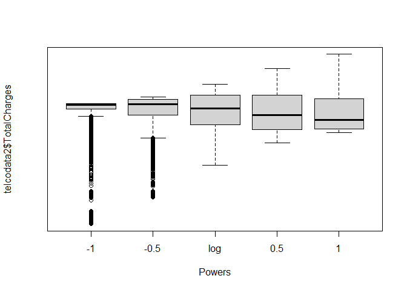

No transformation is needed for MonthlyCharges and tenure. A sqrt
transformation may be better for TotalCharges.

Transforming non-linear variables is important to ensure accuracy of the
model throughout the range of possible x values.

Part d)
-------

Since many of our variables are categorical data, we won’t really find
outliers in the traditional sense there. In regards to TotalCharges, we
can see that there is some right skew in the density plot.

Part e)
-------

``` r
### impute missing values
## Note: for random missing values, we could use various impute methods, MICE, AMELIA, Mean/median, but since our missing values are simply because no payment has been made(new customer <1 month tenure), we simply need to replace NA with 0.

telcodata2[is.na(telcodata2)] <- 0 
```

As noted in the comments above, we simply impute the missing values with
0 because all of our NA’s are not random, but actually because the
tenure length is \<1 month, meaning no charges were made yet. The
dataset had NA’s for TotalCharges = 0 so we simply replace the NA’s with
0.

### Problem 3

``` r
## initial model with predictor variables

telcomodel1 <- glm(Churn ~ tenure + Contract + TotalCharges + MonthlyCharges + OnlineSecurity + InternetService + TechSupport, data = telcodata2, family = "binomial")
summary(telcomodel1)
```

    ## 
    ## Call:
    ## glm(formula = Churn ~ tenure + Contract + TotalCharges + MonthlyCharges + 
    ##     OnlineSecurity + InternetService + TechSupport, family = "binomial", 
    ##     data = telcodata2)
    ## 
    ## Deviance Residuals: 
    ##     Min       1Q   Median       3Q      Max  
    ## -1.6101  -0.7034  -0.2991   0.8351   3.4071  
    ## 
    ## Coefficients:
    ##                              Estimate Std. Error z value Pr(>|z|)    
    ## (Intercept)                -1.402e-01  1.965e-01  -0.714    0.476    
    ## tenure                     -5.848e-02  6.205e-03  -9.425  < 2e-16 ***
    ## ContractOne year           -7.788e-01  1.050e-01  -7.416 1.21e-13 ***
    ## ContractTwo year           -1.548e+00  1.734e-01  -8.931  < 2e-16 ***
    ## TotalCharges                3.394e-04  7.071e-05   4.800 1.59e-06 ***
    ## MonthlyCharges              4.893e-03  3.657e-03   1.338    0.181    
    ## OnlineSecurityYes          -5.400e-01  8.412e-02  -6.419 1.37e-10 ***
    ## InternetServiceFiber optic  6.577e-01  1.401e-01   4.695 2.67e-06 ***
    ## InternetServiceNo          -1.130e+00  1.562e-01  -7.232 4.76e-13 ***
    ## TechSupportYes             -4.676e-01  8.674e-02  -5.390 7.03e-08 ***
    ## ---
    ## Signif. codes:  0 '***' 0.001 '**' 0.01 '*' 0.05 '.' 0.1 ' ' 1
    ## 
    ## (Dispersion parameter for binomial family taken to be 1)
    ## 
    ##     Null deviance: 8150.1  on 7042  degrees of freedom
    ## Residual deviance: 5969.1  on 7033  degrees of freedom
    ## AIC: 5989.1
    ## 
    ## Number of Fisher Scoring iterations: 6

``` r
## testing transformations

telcomodel2 <- glm(Churn ~ tenure + Contract + sqrt(TotalCharges) + MonthlyCharges + OnlineSecurity + InternetService + TechSupport, data = telcodata2, family = "binomial")
summary(telcomodel2)
```

    ## 
    ## Call:
    ## glm(formula = Churn ~ tenure + Contract + sqrt(TotalCharges) + 
    ##     MonthlyCharges + OnlineSecurity + InternetService + TechSupport, 
    ##     family = "binomial", data = telcodata2)
    ## 
    ## Deviance Residuals: 
    ##     Min       1Q   Median       3Q      Max  
    ## -1.9610  -0.6555  -0.3160   0.6829   2.9396  
    ## 
    ## Coefficients:
    ##                             Estimate Std. Error z value Pr(>|z|)    
    ## (Intercept)                -1.004794   0.168721  -5.955 2.59e-09 ***
    ## tenure                      0.011309   0.007028   1.609 0.107575    
    ## ContractOne year           -0.827160   0.104889  -7.886 3.12e-15 ***
    ## ContractTwo year           -1.802120   0.180204 -10.000  < 2e-16 ***
    ## sqrt(TotalCharges)         -0.046273   0.007473  -6.192 5.94e-10 ***
    ## MonthlyCharges              0.028339   0.004119   6.880 5.97e-12 ***
    ## OnlineSecurityYes          -0.520060   0.084695  -6.140 8.23e-10 ***
    ## InternetServiceFiber optic  0.495772   0.140460   3.530 0.000416 ***
    ## InternetServiceNo          -0.857899   0.152685  -5.619 1.92e-08 ***
    ## TechSupportYes             -0.429877   0.087605  -4.907 9.25e-07 ***
    ## ---
    ## Signif. codes:  0 '***' 0.001 '**' 0.01 '*' 0.05 '.' 0.1 ' ' 1
    ## 
    ## (Dispersion parameter for binomial family taken to be 1)
    ## 
    ##     Null deviance: 8150.1  on 7042  degrees of freedom
    ## Residual deviance: 5955.9  on 7033  degrees of freedom
    ## AIC: 5975.9
    ## 
    ## Number of Fisher Scoring iterations: 6

Since the transformed model has a lower AIC it is likely a better model
than the untransformed model. However, given we have a logistical
regression and the interpretability of the coefficents may prove
difficult with an additional sqrt transformation, we will stick with
linear as the difference is not much.

``` r
## model with statistically insignificant variables removed

telcomodel1 <- glm(Churn ~ tenure + Contract + TotalCharges  + OnlineSecurity + InternetService + TechSupport, data = telcodata2, family = "binomial")
summary(telcomodel1)
```

    ## 
    ## Call:
    ## glm(formula = Churn ~ tenure + Contract + TotalCharges + OnlineSecurity + 
    ##     InternetService + TechSupport, family = "binomial", data = telcodata2)
    ## 
    ## Deviance Residuals: 
    ##     Min       1Q   Median       3Q      Max  
    ## -1.5664  -0.7073  -0.2986   0.8352   3.4325  
    ## 
    ## Coefficients:
    ##                              Estimate Std. Error z value Pr(>|z|)    
    ## (Intercept)                 1.016e-01  7.722e-02   1.315    0.188    
    ## tenure                     -6.116e-02  5.900e-03 -10.367  < 2e-16 ***
    ## ContractOne year           -7.677e-01  1.047e-01  -7.331 2.28e-13 ***
    ## ContractTwo year           -1.544e+00  1.736e-01  -8.896  < 2e-16 ***
    ## TotalCharges                3.821e-04  6.333e-05   6.034 1.60e-09 ***
    ## OnlineSecurityYes          -5.221e-01  8.298e-02  -6.292 3.14e-10 ***
    ## InternetServiceFiber optic  8.049e-01  8.734e-02   9.216  < 2e-16 ***
    ## InternetServiceNo          -1.257e+00  1.237e-01 -10.167  < 2e-16 ***
    ## TechSupportYes             -4.382e-01  8.381e-02  -5.229 1.71e-07 ***
    ## ---
    ## Signif. codes:  0 '***' 0.001 '**' 0.01 '*' 0.05 '.' 0.1 ' ' 1
    ## 
    ## (Dispersion parameter for binomial family taken to be 1)
    ## 
    ##     Null deviance: 8150.1  on 7042  degrees of freedom
    ## Residual deviance: 5970.9  on 7034  degrees of freedom
    ## AIC: 5988.9
    ## 
    ## Number of Fisher Scoring iterations: 6

``` r
## Testing for multicollinearity, 1 is none, 1<x<5 is moderate >5 is high

vif(telcomodel1)
```

    ##                      GVIF Df GVIF^(1/(2*Df))
    ## tenure          14.590121  1        3.819702
    ## Contract         1.516649  2        1.109740
    ## TotalCharges    16.855432  1        4.105537
    ## OnlineSecurity   1.121674  1        1.059091
    ## InternetService  1.774297  2        1.154135
    ## TechSupport      1.168936  1        1.081174

As we can see, tenure and TotalCharges are colinear, we will remove
TotalCharges.

``` r
## model with statistically insignificant and colinear variables removed

telcomodel1.adj <- glm(Churn ~ tenure + Contract  + OnlineSecurity + InternetService + TechSupport, data = telcodata2, family = "binomial")
summary(telcomodel1.adj)
```

    ## 
    ## Call:
    ## glm(formula = Churn ~ tenure + Contract + OnlineSecurity + InternetService + 
    ##     TechSupport, family = "binomial", data = telcodata2)
    ## 
    ## Deviance Residuals: 
    ##     Min       1Q   Median       3Q      Max  
    ## -1.5928  -0.6583  -0.3063   0.8127   3.0362  
    ## 
    ## Coefficients:
    ##                             Estimate Std. Error z value Pr(>|z|)    
    ## (Intercept)                -0.117146   0.068186  -1.718   0.0858 .  
    ## tenure                     -0.028506   0.001965 -14.505  < 2e-16 ***
    ## ContractOne year           -0.745241   0.103550  -7.197 6.16e-13 ***
    ## ContractTwo year           -1.491315   0.171155  -8.713  < 2e-16 ***
    ## OnlineSecurityYes          -0.475405   0.082694  -5.749 8.98e-09 ***
    ## InternetServiceFiber optic  1.083948   0.074317  14.586  < 2e-16 ***
    ## InternetServiceNo          -1.309075   0.122306 -10.703  < 2e-16 ***
    ## TechSupportYes             -0.354452   0.082735  -4.284 1.83e-05 ***
    ## ---
    ## Signif. codes:  0 '***' 0.001 '**' 0.01 '*' 0.05 '.' 0.1 ' ' 1
    ## 
    ## (Dispersion parameter for binomial family taken to be 1)
    ## 
    ##     Null deviance: 8150.1  on 7042  degrees of freedom
    ## Residual deviance: 6010.2  on 7035  degrees of freedom
    ## AIC: 6026.2
    ## 
    ## Number of Fisher Scoring iterations: 6

``` r
## assessing multicollinearity after removal
vif(telcomodel1.adj)
```

    ##                     GVIF Df GVIF^(1/(2*Df))
    ## tenure          1.561896  1        1.249758
    ## Contract        1.484592  2        1.103829
    ## OnlineSecurity  1.108590  1        1.052896
    ## InternetService 1.258150  2        1.059091
    ## TechSupport     1.129753  1        1.062898

As far as I am aware, we do not need to test for heteroskedasticity
because we have a logistic regression and there is no assumption of
equal variance. The data is assumed to be distributed as a binomial
where variance is determined by the mean. Similarly, residuals and
errors cannot really be interpreted and assumed normal in the
traditional sense either. Therefore, Cook’s Distance would not really be
relevant here.

I included code of how I would calculate Cook’s Distance and remove
influential outliers if this was a normal linear regression model at the
bottom of the project.

``` r
## testing for power terms and possible interaction effects

telcomodel1.interactions <- glm(Churn ~ (tenure + Contract  + OnlineSecurity + InternetService + TechSupport)^2, data = telcodata2, family = "binomial")
summary(telcomodel1.interactions)
```

    ## 
    ## Call:
    ## glm(formula = Churn ~ (tenure + Contract + OnlineSecurity + InternetService + 
    ##     TechSupport)^2, family = "binomial", data = telcodata2)
    ## 
    ## Deviance Residuals: 
    ##     Min       1Q   Median       3Q      Max  
    ## -1.6201  -0.7053  -0.3141   0.7919   3.1809  
    ## 
    ## Coefficients: (2 not defined because of singularities)
    ##                                               Estimate Std. Error z value
    ## (Intercept)                                   0.070901   0.093357   0.759
    ## tenure                                       -0.038688   0.004992  -7.750
    ## ContractOne year                             -1.713221   0.310314  -5.521
    ## ContractTwo year                             -3.468349   0.845098  -4.104
    ## OnlineSecurityYes                            -0.648914   0.163933  -3.958
    ## InternetServiceFiber optic                    0.959240   0.113050   8.485
    ## InternetServiceNo                            -1.088229   0.160568  -6.777
    ## TechSupportYes                               -0.539344   0.164022  -3.288
    ## tenure:ContractOne year                       0.029533   0.006123   4.823
    ## tenure:ContractTwo year                       0.044673   0.012417   3.598
    ## tenure:OnlineSecurityYes                      0.004086   0.005046   0.810
    ## tenure:InternetServiceFiber optic             0.007403   0.005071   1.460
    ## tenure:InternetServiceNo                     -0.021376   0.012389  -1.725
    ## tenure:TechSupportYes                        -0.008144   0.005480  -1.486
    ## ContractOne year:OnlineSecurityYes           -0.106551   0.247637  -0.430
    ## ContractTwo year:OnlineSecurityYes           -0.513653   0.409928  -1.253
    ## ContractOne year:InternetServiceFiber optic  -0.474621   0.267454  -1.775
    ## ContractTwo year:InternetServiceFiber optic  -0.329955   0.449969  -0.733
    ## ContractOne year:InternetServiceNo           -0.176977   0.475508  -0.372
    ## ContractTwo year:InternetServiceNo            0.340924   0.836927   0.407
    ## ContractOne year:TechSupportYes               0.699252   0.247573   2.824
    ## ContractTwo year:TechSupportYes               0.428762   0.426955   1.004
    ## OnlineSecurityYes:InternetServiceFiber optic -0.036155   0.182737  -0.198
    ## OnlineSecurityYes:InternetServiceNo                 NA         NA      NA
    ## OnlineSecurityYes:TechSupportYes              0.380632   0.189035   2.014
    ## InternetServiceFiber optic:TechSupportYes     0.192367   0.186929   1.029
    ## InternetServiceNo:TechSupportYes                    NA         NA      NA
    ##                                              Pr(>|z|)    
    ## (Intercept)                                  0.447576    
    ## tenure                                       9.16e-15 ***
    ## ContractOne year                             3.37e-08 ***
    ## ContractTwo year                             4.06e-05 ***
    ## OnlineSecurityYes                            7.55e-05 ***
    ## InternetServiceFiber optic                    < 2e-16 ***
    ## InternetServiceNo                            1.22e-11 ***
    ## TechSupportYes                               0.001008 ** 
    ## tenure:ContractOne year                      1.41e-06 ***
    ## tenure:ContractTwo year                      0.000321 ***
    ## tenure:OnlineSecurityYes                     0.418113    
    ## tenure:InternetServiceFiber optic            0.144336    
    ## tenure:InternetServiceNo                     0.084459 .  
    ## tenure:TechSupportYes                        0.137209    
    ## ContractOne year:OnlineSecurityYes           0.667000    
    ## ContractTwo year:OnlineSecurityYes           0.210194    
    ## ContractOne year:InternetServiceFiber optic  0.075966 .  
    ## ContractTwo year:InternetServiceFiber optic  0.463385    
    ## ContractOne year:InternetServiceNo           0.709754    
    ## ContractTwo year:InternetServiceNo           0.683750    
    ## ContractOne year:TechSupportYes              0.004737 ** 
    ## ContractTwo year:TechSupportYes              0.315266    
    ## OnlineSecurityYes:InternetServiceFiber optic 0.843161    
    ## OnlineSecurityYes:InternetServiceNo                NA    
    ## OnlineSecurityYes:TechSupportYes             0.044057 *  
    ## InternetServiceFiber optic:TechSupportYes    0.303435    
    ## InternetServiceNo:TechSupportYes                   NA    
    ## ---
    ## Signif. codes:  0 '***' 0.001 '**' 0.01 '*' 0.05 '.' 0.1 ' ' 1
    ## 
    ## (Dispersion parameter for binomial family taken to be 1)
    ## 
    ##     Null deviance: 8150.1  on 7042  degrees of freedom
    ## Residual deviance: 5941.8  on 7018  degrees of freedom
    ## AIC: 5991.8
    ## 
    ## Number of Fisher Scoring iterations: 7

Two statistically significant interaction effects are
Contract:TechSupport and OnlineSecurity:TechSupport. Lets build them
into our model.

``` r
## model with interaction effects and statistically insignificant effects removed

telcomodel1.adj.interaction <- glm(Churn ~ tenure + Contract  + OnlineSecurity + InternetService + TechSupport + Contract:TechSupport, data = telcodata2, family = "binomial")
summary(telcomodel1.adj.interaction)
```

    ## 
    ## Call:
    ## glm(formula = Churn ~ tenure + Contract + OnlineSecurity + InternetService + 
    ##     TechSupport + Contract:TechSupport, family = "binomial", 
    ##     data = telcodata2)
    ## 
    ## Deviance Residuals: 
    ##     Min       1Q   Median       3Q      Max  
    ## -1.6036  -0.6654  -0.3025   0.8045   3.0802  
    ## 
    ## Coefficients:
    ##                                  Estimate Std. Error z value Pr(>|z|)    
    ## (Intercept)                     -0.091276   0.068570  -1.331 0.183141    
    ## tenure                          -0.028298   0.001969 -14.369  < 2e-16 ***
    ## ContractOne year                -0.994349   0.129011  -7.707 1.28e-14 ***
    ## ContractTwo year                -1.698537   0.250868  -6.771 1.28e-11 ***
    ## OnlineSecurityYes               -0.480021   0.082839  -5.795 6.85e-09 ***
    ## InternetServiceFiber optic       1.081722   0.074323  14.554  < 2e-16 ***
    ## InternetServiceNo               -1.275522   0.123236 -10.350  < 2e-16 ***
    ## TechSupportYes                  -0.536776   0.097351  -5.514 3.51e-08 ***
    ## ContractOne year:TechSupportYes  0.717485   0.196634   3.649 0.000263 ***
    ## ContractTwo year:TechSupportYes  0.474686   0.320053   1.483 0.138034    
    ## ---
    ## Signif. codes:  0 '***' 0.001 '**' 0.01 '*' 0.05 '.' 0.1 ' ' 1
    ## 
    ## (Dispersion parameter for binomial family taken to be 1)
    ## 
    ##     Null deviance: 8150.1  on 7042  degrees of freedom
    ## Residual deviance: 5996.2  on 7033  degrees of freedom
    ## AIC: 6016.2
    ## 
    ## Number of Fisher Scoring iterations: 6

``` r
## AIC and BIC of model with and without interaction effects
AIC(telcomodel1.adj, telcomodel1.adj.interaction)
```

    ##                             df      AIC
    ## telcomodel1.adj              8 6026.248
    ## telcomodel1.adj.interaction 10 6016.164

``` r
BIC(telcomodel1.adj, telcomodel1.adj.interaction)
```

    ##                             df      BIC
    ## telcomodel1.adj              8 6081.126
    ## telcomodel1.adj.interaction 10 6084.762

Since the model with interactions has a higher BIC, but lower AIC, we
are not sure if the interaction effects helped improve the model. Then
for interpretability sake, we will stick with the model with no
interactions.

``` r
## anova test to see significance of variables on resid.dev
anova(telcomodel1.adj, test="Chisq")
```

    ## Analysis of Deviance Table
    ## 
    ## Model: binomial, link: logit
    ## 
    ## Response: Churn
    ## 
    ## Terms added sequentially (first to last)
    ## 
    ## 
    ##                 Df Deviance Resid. Df Resid. Dev  Pr(>Chi)    
    ## NULL                             7042     8150.1              
    ## tenure           1   958.28      7041     7191.9 < 2.2e-16 ***
    ## Contract         2   526.73      7039     6665.1 < 2.2e-16 ***
    ## OnlineSecurity   1    26.73      7038     6638.4 2.338e-07 ***
    ## InternetService  2   609.62      7036     6028.8 < 2.2e-16 ***
    ## TechSupport      1    18.55      7035     6010.2 1.659e-05 ***
    ## ---
    ## Signif. codes:  0 '***' 0.001 '**' 0.01 '*' 0.05 '.' 0.1 ' ' 1

As we can see, tenure, Contract, and InternetService has a large effect
on Churn. All variables are statistically significant however, and do
have atleast some effect on Churn rate.

``` r
##bootstrapping

library(boot)  
```

    ## 
    ## Attaching package: 'boot'

    ## The following object is masked from 'package:lattice':
    ## 
    ##     melanoma

    ## The following object is masked from 'package:survival':
    ## 
    ##     aml

    ## The following object is masked from 'package:car':
    ## 
    ##     logit

``` r
logit_test <- function(d,indices) {  
d <- d[indices,]  
fit <- glm(Churn ~ tenure + Contract  + OnlineSecurity + InternetService + TechSupport, data = d, family = "binomial")  
return(coef(fit))  
}
boot_fit <- boot(  
   data = telcodata2, 
   statistic = logit_test, 
   R = 1000
) 

boot_fit
```

    ## 
    ## ORDINARY NONPARAMETRIC BOOTSTRAP
    ## 
    ## 
    ## Call:
    ## boot(data = telcodata2, statistic = logit_test, R = 1000)
    ## 
    ## 
    ## Bootstrap Statistics :
    ##        original        bias    std. error
    ## t1* -0.11714605 -2.933313e-03 0.064963461
    ## t2* -0.02850617 -5.305288e-05 0.001910381
    ## t3* -0.74524115  2.997046e-03 0.100198243
    ## t4* -1.49131476 -1.418609e-02 0.165853778
    ## t5* -0.47540491 -7.627251e-04 0.085144919
    ## t6*  1.08394769  4.043714e-03 0.072609292
    ## t7* -1.30907494  1.446307e-04 0.119990688
    ## t8* -0.35445218  6.392419e-05 0.082986097

``` r
## change index to see plot for different coefficients (should appear normal and linear)
plot(boot_fit, index=2)
```

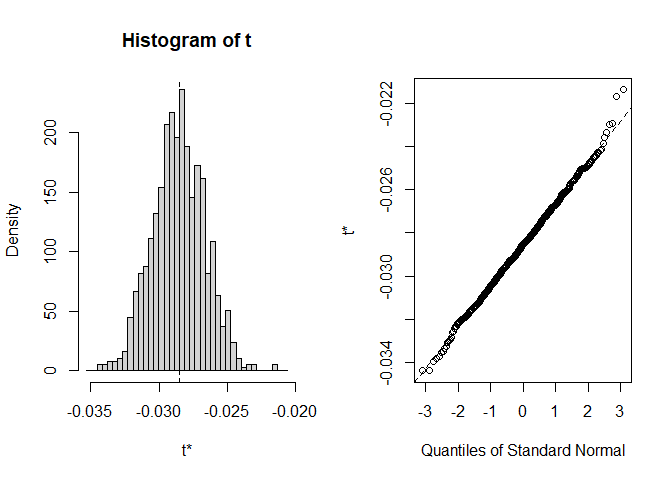

Distribution of bootstrap correlation coefficients seem pretty normal;
quantiles of standard normal linear as well which is good.

``` r
## change index to see 95% boot.ci interval for the different coefficients
boot.ci(boot_fit,index=8, type="norm")
```

    ## BOOTSTRAP CONFIDENCE INTERVAL CALCULATIONS
    ## Based on 1000 bootstrap replicates
    ## 
    ## CALL : 
    ## boot.ci(boot.out = boot_fit, type = "norm", index = 8)
    ## 
    ## Intervals : 
    ## Level      Normal        
    ## 95%   (-0.5172, -0.1919 )  
    ## Calculations and Intervals on Original Scale

All of our bootstrapped coefficients remain significant (strictly
positive or negative) except intercept which is fine. This shows our
model is robust and likely not overspecified.

``` r
### Splitting 20% of data set to become test data
n = nrow(telcodata2)

train_index = sample(n, floor(.8 * n))

train_data1 = telcodata2[train_index,]

test_data1 = telcodata2[-train_index,]
```

``` r
### 5-fold cross-validation test

## Define Training Control

set.seed(123)
train.control <- trainControl(method = "cv", number = 5)

## Train the model
telcomodel1.adj.train <- train(Churn ~ tenure + Contract  + OnlineSecurity + InternetService + TechSupport, data = test_data1, method = "glm", family="binomial", trControl = train.control)
```

    ## Warning in predict.lm(object, newdata, se.fit, scale = 1, type = if (type == :
    ## prediction from a rank-deficient fit may be misleading

    ## Warning in predict.lm(object, newdata, se.fit, scale = 1, type = if (type == :
    ## prediction from a rank-deficient fit may be misleading

    ## Warning in predict.lm(object, newdata, se.fit, scale = 1, type = if (type == :
    ## prediction from a rank-deficient fit may be misleading

    ## Warning in predict.lm(object, newdata, se.fit, scale = 1, type = if (type == :
    ## prediction from a rank-deficient fit may be misleading

    ## Warning in predict.lm(object, newdata, se.fit, scale = 1, type = if (type == :
    ## prediction from a rank-deficient fit may be misleading

``` r
## Summarize the results
print(telcomodel1.adj.train)
```

    ## Generalized Linear Model 
    ## 
    ## 1409 samples
    ##    5 predictor
    ##    2 classes: 'No', 'Yes' 
    ## 
    ## No pre-processing
    ## Resampling: Cross-Validated (5 fold) 
    ## Summary of sample sizes: 1127, 1127, 1126, 1128, 1128 
    ## Resampling results:
    ## 
    ##   Accuracy   Kappa    
    ##   0.7920536  0.4206306

Since our classifier of Churn (yes or no) is imbalanced as seen from the
barplot above (\~2000 yes \~5000 no), it is likely good to look at both
the accuracy and the Kappa. Without diving too deep into the
interpretation (I don’t believe I am quite capable enough to accurately
give a robust and correct interpretation), generally a Kappa of .4 and
above is fair to good performance and given our accuracy of around 78%
we are going to be pretty okay with our model here as a student.

``` r
## Chosen model
summary(telcomodel1.adj)
```

    ## 
    ## Call:
    ## glm(formula = Churn ~ tenure + Contract + OnlineSecurity + InternetService + 
    ##     TechSupport, family = "binomial", data = telcodata2)
    ## 
    ## Deviance Residuals: 
    ##     Min       1Q   Median       3Q      Max  
    ## -1.5928  -0.6583  -0.3063   0.8127   3.0362  
    ## 
    ## Coefficients:
    ##                             Estimate Std. Error z value Pr(>|z|)    
    ## (Intercept)                -0.117146   0.068186  -1.718   0.0858 .  
    ## tenure                     -0.028506   0.001965 -14.505  < 2e-16 ***
    ## ContractOne year           -0.745241   0.103550  -7.197 6.16e-13 ***
    ## ContractTwo year           -1.491315   0.171155  -8.713  < 2e-16 ***
    ## OnlineSecurityYes          -0.475405   0.082694  -5.749 8.98e-09 ***
    ## InternetServiceFiber optic  1.083948   0.074317  14.586  < 2e-16 ***
    ## InternetServiceNo          -1.309075   0.122306 -10.703  < 2e-16 ***
    ## TechSupportYes             -0.354452   0.082735  -4.284 1.83e-05 ***
    ## ---
    ## Signif. codes:  0 '***' 0.001 '**' 0.01 '*' 0.05 '.' 0.1 ' ' 1
    ## 
    ## (Dispersion parameter for binomial family taken to be 1)
    ## 
    ##     Null deviance: 8150.1  on 7042  degrees of freedom
    ## Residual deviance: 6010.2  on 7035  degrees of freedom
    ## AIC: 6026.2
    ## 
    ## Number of Fisher Scoring iterations: 6

Interpretation of model (log odds)
----------------------------------

### Holding all else constant;

Tenure: For every month increase in tenure, the odds of churn decrease
by 2.81%

Contract: As opposed to month-by-month contracts, a One Year contract
decreases churn rate by 52.54%. - Similarly, as opposed to
month-by-month contracts, a two year contract decreases churn rate by
77.49%.

OnlineSecurity: As opposed to not having Online Security, a customer
with OnlineSecurity decreases churn rate by 37.84%.

InternetService: As opposed to DSL, customers with Fiber Optics have a
195.63% higher churn rate. - On the other hand, as opposed to DSL,
customers with no internet service have a 72.99% decrease in churn rate.

TechSupport: As opposed to not having Tech Support, customers with
TechSupport have a 29.84% decrease in churn rate.

### Conclusion

Biggest takeaways from building and interpreting this model is that:

1.  Customers with Fiber Optics have **HUGELY** higher churn rate and as
    a Telco business, being aware of that may prove very profitable.

2.  Offering TechSupport and OnlineSecurity pay significant dividends in
    keeping churn rate lower.

3.  Unsurprisingly, One-Year and Two-Year contracts have significantly
    lower churn rates than month-by-month contracts.

4.  The longer your customer has been your customer (tenure), the less
    likely they are to switch providers (churn).

Touching back on what I said in the introduction, I really wanted to
work with this dataset to get a feel on how to discover actionable
insights from data analysis in a practical setting. Customer churn seems
very relevant to a business and being able to determine some patterns in
customer churn rate would bring value to the company.

This was the first time I have worked with Logistical Regression and I
don’t believe we learned about it in class yet so this was a fun and
difficult project for me to take. Given that it is a logistical
regression and not a linear regression, I read that many of the
validation tests such as tests for heteroskedasticity and looking at
outliers are not exactly applicable to this model. However, I did not
want to start over and explore a dataset that I wasn’t as passionate
about and I definitely did not want to back down simply because I have
never done this process before. However, since many of the questions
asked about things like Cooks Distance and heteroskedasticity, I
included some code I would write for linear models so it doesn’t look
like I am trying to take an easy way out.

    ## How I would find influential outliers for linear model (docreg is model)

    # Find influential outliers using Cook's Distance
    influencePlot(docreg)
    cooksd <- cooks.distance(docreg)
    plot(cooksd)
    abline(h = 4/(nrow(docmodel)-11), col = "red")
    text(x=1:length(cooksd)+1, y=cooksd, labels=ifelse(cooksd>4/(nrow(docmodel)), names(cooksd),""), col="red")
    # Removing influential outliers using threshold of 4/N-k-1
    influential.doc <- as.numeric(names(cooksd)[(cooksd > 4/(nrow(docmodel)))])
    # New data set without outliers
    docmod.adj <- docmodel[-c(influential.doc),] 

    ## How I would test for heteroskedasticity

    library(lmtest)
    bptest(model)

    ## How I would resolve 
    library(sandwich)
    coeftest(model, vcov = vcovHC(model, "HC1")

    ## since sample is large we could then work with those White standard errors
