``` r
library(tidyverse)
```

    ## -- Attaching packages ----------------------------------------------------------------- tidyverse 1.3.0 --

    ## v ggplot2 3.3.2     v purrr   0.3.4
    ## v tibble  3.0.3     v dplyr   1.0.2
    ## v tidyr   1.1.2     v stringr 1.4.0
    ## v readr   1.3.1     v forcats 0.5.0

    ## -- Conflicts -------------------------------------------------------------------- tidyverse_conflicts() --
    ## x dplyr::filter() masks stats::filter()
    ## x dplyr::lag()    masks stats::lag()

``` r
library(car)
```

    ## Loading required package: carData

    ## 
    ## Attaching package: 'car'

    ## The following object is masked from 'package:dplyr':
    ## 
    ##     recode

    ## The following object is masked from 'package:purrr':
    ## 
    ##     some

``` r
library(ggplot2)
library(DataExplorer)
library(pastecs)
```

    ## 
    ## Attaching package: 'pastecs'

    ## The following objects are masked from 'package:dplyr':
    ## 
    ##     first, last

    ## The following object is masked from 'package:tidyr':
    ## 
    ##     extract

``` r
library(plyr)
```

    ## ------------------------------------------------------------------------------

    ## You have loaded plyr after dplyr - this is likely to cause problems.
    ## If you need functions from both plyr and dplyr, please load plyr first, then dplyr:
    ## library(plyr); library(dplyr)

    ## ------------------------------------------------------------------------------

    ## 
    ## Attaching package: 'plyr'

    ## The following objects are masked from 'package:dplyr':
    ## 
    ##     arrange, count, desc, failwith, id, mutate, rename, summarise,
    ##     summarize

    ## The following object is masked from 'package:purrr':
    ## 
    ##     compact

``` r
library(effects)
```

    ## Registered S3 methods overwritten by 'lme4':
    ##   method                          from
    ##   cooks.distance.influence.merMod car 
    ##   influence.merMod                car 
    ##   dfbeta.influence.merMod         car 
    ##   dfbetas.influence.merMod        car

    ## lattice theme set by effectsTheme()
    ## See ?effectsTheme for details.

``` r
library(tseries)
```

    ## Registered S3 method overwritten by 'quantmod':
    ##   method            from
    ##   as.zoo.data.frame zoo

``` r
library(AER)
```

    ## Loading required package: lmtest

    ## Loading required package: zoo

    ## 
    ## Attaching package: 'zoo'

    ## The following objects are masked from 'package:base':
    ## 
    ##     as.Date, as.Date.numeric

    ## Loading required package: sandwich

    ## Loading required package: survival

``` r
library(broom)
library(leaps)
library(caret)
```

    ## Loading required package: lattice

    ## 
    ## Attaching package: 'caret'

    ## The following object is masked from 'package:survival':
    ## 
    ##     cluster

    ## The following object is masked from 'package:purrr':
    ## 
    ##     lift

``` r
library(mice)
```

    ## 
    ## Attaching package: 'mice'

    ## The following objects are masked from 'package:base':
    ## 
    ##     cbind, rbind

``` r
## load dataset
housepricemodel_orig <- read.table("C:/Users/Matt/Downloads/train.csv", header=TRUE, sep = ",")
```

### Problem 1)

10 variables chosen:

1.  GarageArea
2.  LotArea
3.  TotRmsAbvGrd
4.  Neighborhood
5.  OpenPorchSF
6.  YearRemodAdd
7.  GrLivArea
8.  TotalBsmtSF
9.  OverallQual
10. CentralAir

<!-- -->

    I picked these 10 because I believed they would give a good overall measure of how houses are priced; size of various areas of the house and lot, rooms, year it was constructed/remodelled, location, and overall quality. TotRmsAbvGrd and GrLivArea gives us an idea of the size of the house, which may be an important factor in house prices. OpenPorchSF to see if how large the front porch area is affects house prices; similarly, TotalBsmtSF too see if a large basement affects prices, GarageArea for garage size, and LotArea for lot size. Neighborhood gives us an idea of location of house within Ames, which may also be an important factor. YearRemodAdd gives us an idea of the year it was built/remodelled. CentralAir to see the effect that functionality has on willingness to pay. And finally, OverallQual gives us a clearer picture on the overall material and finish of the house. I picked these 10 variables to hopefully give us a round, complete picture of the house and all factors that could affect the price.

``` r
## keep variables desired
hpmodel <- subset(housepricemodel_orig, select = c("GarageArea", "LotArea", "TotRmsAbvGrd", "Neighborhood", "OpenPorchSF", "YearRemodAdd", "GrLivArea", "TotalBsmtSF", "OverallQual", "CentralAir", "SalePrice"))

### Change categorical variables to factor variables for - Neighborhood, CentralAir

## Analyzing Neighborhood vs price to see if I can simplify the variable into bins/fewer parts
Neighborhood.id <- revalue(hpmodel$Neighborhood, c("Blmngtn" = "1", "Blueste" = "2", "BrDale" = "3", "BrkSide" = "4", "ClearCr" = "5", "CollgCr" = "6", "Crawfor" = "7", "Edwards" = "8", "Gilbert" = "9", "IDOTRR" = "10", "MeadowV" = "11", "Mitchel" = "12", "NAmes" = "13", "NoRidge" = "14", "NPkVill" = "15", "NridgHt" = "16", "NWAmes" = "17", "OldTown" = "18", "SWISU" = "19", "Sawyer" = "20", "SawyerW" = "21", "Somerst" = "22", "StoneBr" = "23", "Timber" = "24", "Veenker" = "25"))

## CentralAir
hpmodel$CentralAir <- revalue(hpmodel$CentralAir, c("N" = "0", "Y" = "1"))

### Change variables to factor
Neighborhood.id<- as.factor(Neighborhood.id)
hpmodel$CentralAir <- as.factor(hpmodel$CentralAir)
```

``` r
## Neighborhood plotted against SalePrice
plot(Neighborhood.id, hpmodel$SalePrice, xlab = "Neighborhood")
```

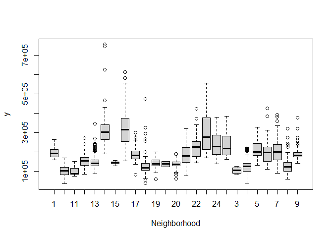

``` r
nreg.mod = lm(SalePrice ~ Neighborhood.id, data=hpmodel)
plot(allEffects(nreg.mod))
```

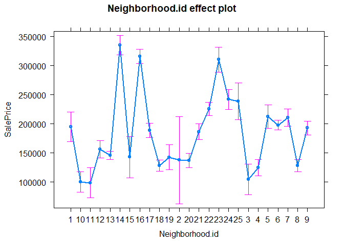

``` r
summary(nreg.mod)
```

    ## 
    ## Call:
    ## lm(formula = SalePrice ~ Neighborhood.id, data = hpmodel)
    ## 
    ## Residuals:
    ##     Min      1Q  Median      3Q     Max 
    ## -162271  -27552   -5324   19685  419705 
    ## 
    ## Coefficients:
    ##                   Estimate Std. Error t value Pr(>|t|)    
    ## (Intercept)         194871      13097  14.879  < 2e-16 ***
    ## Neighborhood.id10   -94747      15822  -5.988 2.67e-09 ***
    ## Neighborhood.id11   -96294      18522  -5.199 2.29e-07 ***
    ## Neighborhood.id12   -38601      15200  -2.540 0.011204 *  
    ## Neighborhood.id13   -49024      13582  -3.609 0.000318 ***
    ## Neighborhood.id14   140424      15577   9.015  < 2e-16 ***
    ## Neighborhood.id15   -52176      22260  -2.344 0.019217 *  
    ## Neighborhood.id16   121400      14470   8.390  < 2e-16 ***
    ## Neighborhood.id17    -5821      14542  -0.400 0.689011    
    ## Neighborhood.id18   -66646      14047  -4.744 2.30e-06 ***
    ## Neighborhood.id19   -52280      16975  -3.080 0.002111 ** 
    ## Neighborhood.id2    -57371      40367  -1.421 0.155463    
    ## Neighborhood.id20   -58078      14523  -3.999 6.69e-05 ***
    ## Neighborhood.id21    -8315      14864  -0.559 0.575974    
    ## Neighborhood.id22    30509      14333   2.129 0.033456 *  
    ## Neighborhood.id23   115628      16975   6.812 1.42e-11 ***
    ## Neighborhood.id24    47377      15756   3.007 0.002686 ** 
    ## Neighborhood.id25    43902      20895   2.101 0.035810 *  
    ## Neighborhood.id3    -90377      18809  -4.805 1.71e-06 ***
    ## Neighborhood.id4    -70037      14893  -4.703 2.81e-06 ***
    ## Neighborhood.id5     17695      16603   1.066 0.286721    
    ## Neighborhood.id6      3095      13819   0.224 0.822820    
    ## Neighborhood.id7     15754      15123   1.042 0.297712    
    ## Neighborhood.id8    -66651      14166  -4.705 2.78e-06 ***
    ## Neighborhood.id9     -2016      14437  -0.140 0.888944    
    ## ---
    ## Signif. codes:  0 '***' 0.001 '**' 0.01 '*' 0.05 '.' 0.1 ' ' 1
    ## 
    ## Residual standard error: 54000 on 1435 degrees of freedom
    ## Multiple R-squared:  0.5456, Adjusted R-squared:  0.538 
    ## F-statistic: 71.78 on 24 and 1435 DF,  p-value: < 2.2e-16

Based off this chart, in an effort to simplify this 25-part categorical
variable, I am going to aggregate all neighborhood values into 3 bins
based off of their effect on SalePrice. Group 0 = Average, Group 1 =
Good, Group 2 = Wealthy

Group 0 = 10,11,18,3,4,8,20,19,13,12,2,1,17,21,15 Group 1 =
22,24,25,5,6,7,9 Group 2 = 14,16,23

``` r
#### Assigning Group to Neighborhood.id

hpmodel$Neighborhood <- revalue(Neighborhood.id, c("1" = "0", "2" = "0", "3" = "0", "4" = "0", "5" = "1", "6" = "1", "7" = "1", "8" = "0", "9" = "1", "10" = "0", "11" = "0", "12" = "0", "13" = "0", "14" = "2", "15" = "0", "16" = "2", "17" = "0", "18" = "0", "19" = "0", "20" = "0", "21" = "0", "22" = "1", "23" = "2", "24" = "1", "25" = "1"))

### Change factor variables to factor
hpmodel$Neighborhood <- as.factor(hpmodel$Neighborhood)
```

Part a)
-------

``` r
## descriptive statistics
stat.desc(hpmodel)
```

    ##                GarageArea      LotArea TotRmsAbvGrd Neighborhood  OpenPorchSF
    ## nbr.val      1.460000e+03 1.460000e+03 1.460000e+03           NA  1460.000000
    ## nbr.null     8.100000e+01 0.000000e+00 0.000000e+00           NA   656.000000
    ## nbr.na       0.000000e+00 0.000000e+00 0.000000e+00           NA     0.000000
    ## min          0.000000e+00 1.300000e+03 2.000000e+00           NA     0.000000
    ## max          1.418000e+03 2.152450e+05 1.400000e+01           NA   547.000000
    ## range        1.418000e+03 2.139450e+05 1.200000e+01           NA   547.000000
    ## sum          6.905510e+05 1.535457e+07 9.516000e+03           NA 68124.000000
    ## median       4.800000e+02 9.478500e+03 6.000000e+00           NA    25.000000
    ## mean         4.729801e+02 1.051683e+04 6.517808e+00           NA    46.660274
    ## SE.mean      5.595528e+00 2.612216e+02 4.253849e-02           NA     1.733999
    ## CI.mean.0.95 1.097614e+01 5.124101e+02 8.344312e-02           NA     3.401398
    ## var          4.571251e+04 9.962565e+07 2.641903e+00           NA  4389.861203
    ## std.dev      2.138048e+02 9.981265e+03 1.625393e+00           NA    66.256028
    ## coef.var     4.520377e-01 9.490756e-01 2.493773e-01           NA     1.419967
    ##              YearRemodAdd    GrLivArea  TotalBsmtSF  OverallQual CentralAir
    ## nbr.val      1.460000e+03 1.460000e+03 1.460000e+03 1.460000e+03         NA
    ## nbr.null     0.000000e+00 0.000000e+00 3.700000e+01 0.000000e+00         NA
    ## nbr.na       0.000000e+00 0.000000e+00 0.000000e+00 0.000000e+00         NA
    ## min          1.950000e+03 3.340000e+02 0.000000e+00 1.000000e+00         NA
    ## max          2.010000e+03 5.642000e+03 6.110000e+03 1.000000e+01         NA
    ## range        6.000000e+01 5.308000e+03 6.110000e+03 9.000000e+00         NA
    ## sum          2.897904e+06 2.212577e+06 1.543847e+06 8.905000e+03         NA
    ## median       1.994000e+03 1.464000e+03 9.915000e+02 6.000000e+00         NA
    ## mean         1.984866e+03 1.515464e+03 1.057429e+03 6.099315e+00         NA
    ## SE.mean      5.403150e-01 1.375245e+01 1.148144e+01 3.619467e-02         NA
    ## CI.mean.0.95 1.059877e+00 2.697669e+01 2.252190e+01 7.099916e-02         NA
    ## var          4.262328e+02 2.761296e+05 1.924624e+05 1.912679e+00         NA
    ## std.dev      2.064541e+01 5.254804e+02 4.387053e+02 1.382997e+00         NA
    ## coef.var     1.040141e-02 3.467456e-01 4.148790e-01 2.267462e-01         NA
    ##                 SalePrice
    ## nbr.val      1.460000e+03
    ## nbr.null     0.000000e+00
    ## nbr.na       0.000000e+00
    ## min          3.490000e+04
    ## max          7.550000e+05
    ## range        7.201000e+05
    ## sum          2.641449e+08
    ## median       1.630000e+05
    ## mean         1.809212e+05
    ## SE.mean      2.079105e+03
    ## CI.mean.0.95 4.078355e+03
    ## var          6.311111e+09
    ## std.dev      7.944250e+04
    ## coef.var     4.391000e-01

``` r
## Changing -inf to NA
#is.na(hpmodel) <- sapply(hpmodel, is.infinite)
```

This table shows us the number of values, null values, missing values,
the min-max, range, sum, median, mean, SE of mean, 95% CI, var, and
std.dev of the 10 variables I selected. Non-numeric variables
(Neighborhood, CentralAir has been given integer values as shown above).

``` r
## Histogram of hpmodel
plot_histogram(hpmodel)
```

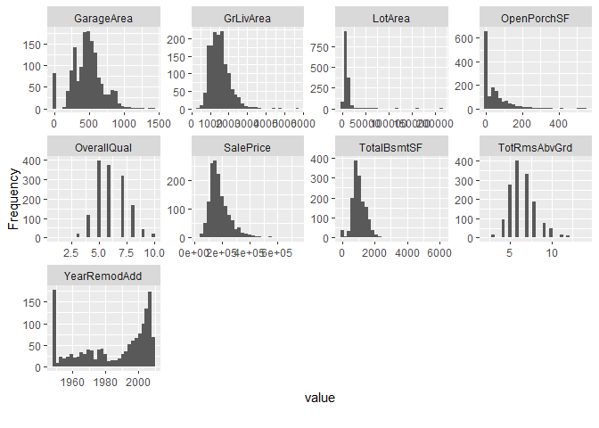

Here lies all the 9 histograms for our variables minus the two
categorical variables. We can get a general idea of the distribution for
each of our variables here (i.e. Most of the houses in our dataset
involve GrLivArea between 1000-2000 sq ft, Most of the houses in our
dataset was remodeled/built at or before 1950 or after 1990).

``` r
## QQ plot of hpmodel
plot_qq(hpmodel, ncol = 4)
```

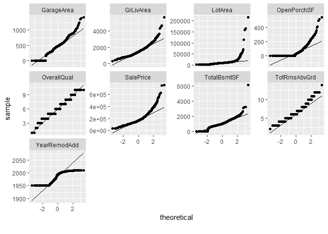

Ignoring Neighborhood and CentralAir, because they are factor variables,
the meat of our data (IQR) within our timeline of study in regards to
that variable (i.e. 1950-2010 for YearRemodAdd) aligns decently well
with the theoretical normal distribution (the line). We say decently and
not perfectly because we can see from the GrLivArea, OpenPorchSF, and
SalePrice, the high end starts to diverge from the normal implying that
as we get into higher end of square footage and price there seems to be
some exponential growth behavior.

``` r
## correlation of variables
plot_correlation(hpmodel)
```

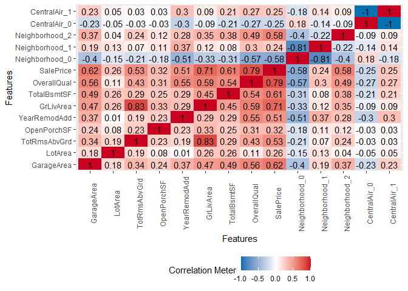

Some interesting things we can find from this chart is that GrLivArea
and TotRmsAbvGr are closely related, which we will probably need to
address in the future (multicollinearity). The most important thing to
notice is the last column, which outlines the correlation between our 10
variables and SalePrice, which is what we are trying to predict and
model. From first glance, it appears OverallQual and GrLivArea may have
the biggest effects on SalePrice.

``` r
## boxplot of variables against SalePrice
plot_boxplot(hpmodel, by = "SalePrice")
```

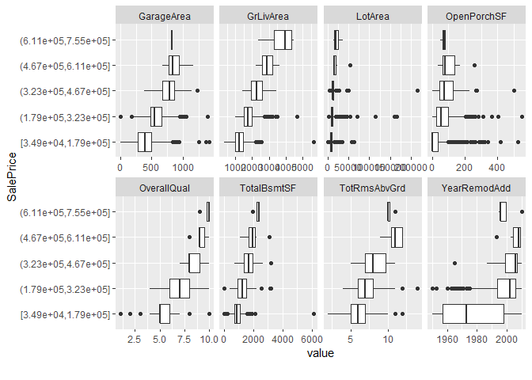

Once again, from all these infographics we want to ignore
Neighborhood/CentralAir as they are indicator variables. With that being
said, right off the bat, we can visually see a generally positive
correlation between TotalBsmtSF, GrLivingArea, OpenPorchSF, OverallQual,
TotRmsAbvGrd, YearRemodAdd, GarageArea and SalePrice. This matches our
intuition.

``` r
##scatterplot of variables against SalePrice
plot_scatterplot(hpmodel, by = "SalePrice", ncol = 4)
```

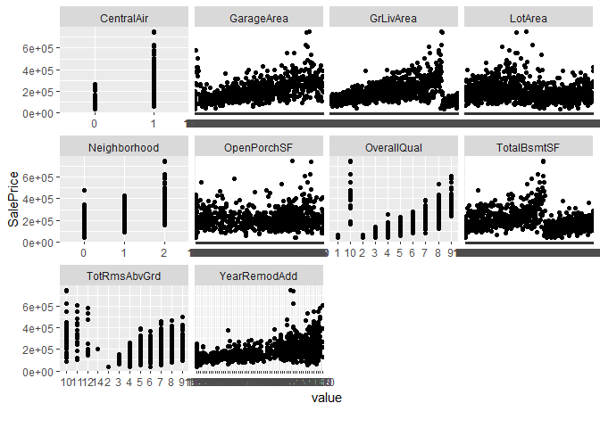

Just another way we can look at how our variables look plotted against
SalePrice. Similar conclusions as boxplot, but it is clearer to see how
the outliers mess with the overall positive trend (OpenPorchSF).

Part b)
-------

``` r
###Using Box-Cox we can determine the best transformation for each non-indicator variable

## GarageArea
symbox(hpmodel$GarageArea, powers = c(-2,-1,-.5,0,0.5,1,2))
```

    ## Warning in symbox.default(hpmodel$GarageArea, powers = c(-2, -1, -0.5, 0, :
    ## start set to 14.18

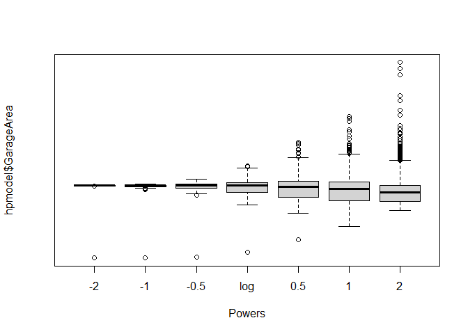

Log transformation appears to be the most normal looking distribution
for GarageArea. However, given the cases where houses may not have
garages, we will stick with a **linear** model.

``` r
## GrLivArea
symbox(hpmodel$GrLivArea, powers = c(-2,-1,-.5,0,0.5,1,2))
```

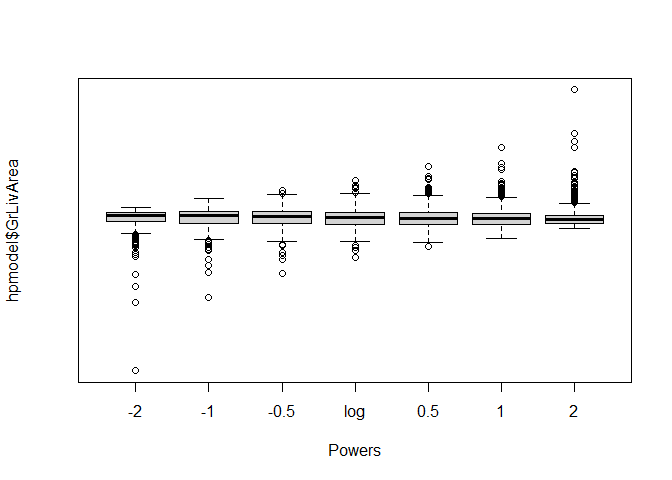

The most “even” looking transformation appears to be a **log**
transformation for GrLivArea.

``` r
## OpenPorchSF
symbox(hpmodel$OpenPorchSF, powers = c(-2,-1,-.5,0,0.5,1,2))
```

    ## Warning in symbox.default(hpmodel$OpenPorchSF, powers = c(-2, -1, -0.5, : start
    ## set to 5.47

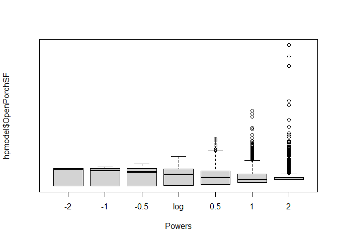

Looks like log seems to be the best transformation for OpenPorchSF as
well as it appears the most even. However, given the nature of the data
and the large amount of 0’s, I will opt for a **sqrt** transformation
instead.

``` r
## OverallQual
symbox(hpmodel$OverallQual, powers = c(-2,-1,-.5,0,0.5,1,2))
```

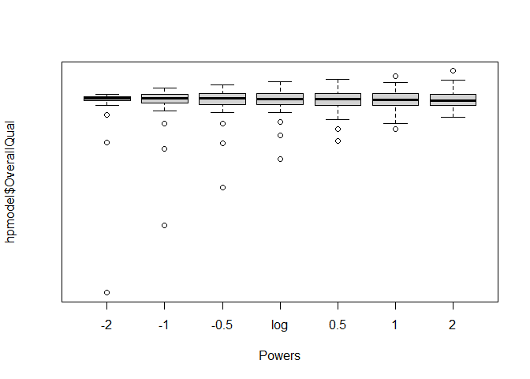

Although a quadratic has one less outlier outside the tails, the
**linear** boxplot is atleast balanced on both ends so we will stick
with that one for OverallQual.

``` r
## TotalBsmtSF
symbox(hpmodel$TotalBsmtSF, powers = c(-1,-.5,0,0.5,1))
```

    ## Warning in symbox.default(hpmodel$TotalBsmtSF, powers = c(-1, -0.5, 0, 0.5, :
    ## start set to 61.1

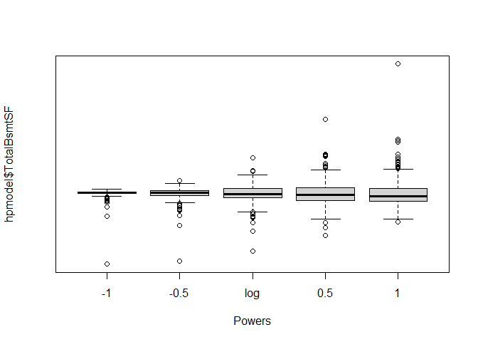

A **sqrt** transformation looks to be the most fitting for TotalBsmtSF.

``` r
## TotRmsAbvGrd
symbox(hpmodel$TotRmsAbvGrd, powers = c(-1,-.5,0,0.5,1))
```

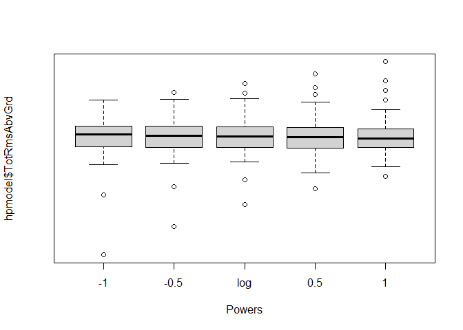

The **log** transformation appears to be the most normal of the 5
choices for TotRmsAbvGrd.

``` r
## YearRemodAdd
symbox(hpmodel$YearRemodAdd, powers = c(-1,-.5,0,0.5,1))
```

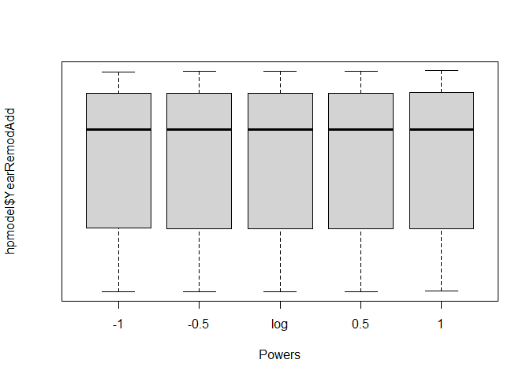

**Linear** seems fine here as any transformation looks fine so we will
keep it as it is.

``` r
## LotArea
symbox(hpmodel$LotArea, powers = c(-1,-.5,0,0.5,1))
```

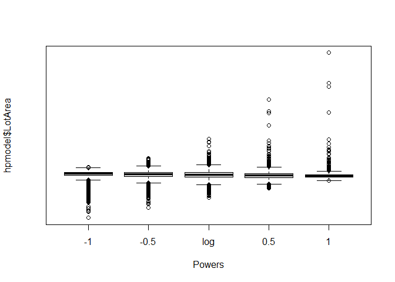

**Log** looks the best for LotArea as it looks the most evenly
distributed.

``` r
## SalePrice
symbox(hpmodel$SalePrice, powers = c(-1,-.5,0,0.5,1))
```

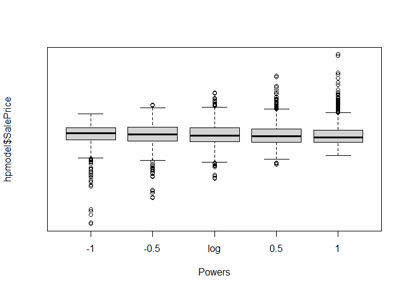

**Log** transformation for SalePrice seems to be the best fit.

``` r
#### Transformations performed on the model (log+1 to keep variables as 0 instead of omission)


## Applying the log transformation to GrLivArea
hpmodel$GrLivArea <- log(hpmodel$GrLivArea)
## Applying the sqrt transformation to OpenPorchSF
hpmodel$OpenPorchSF <- sqrt(hpmodel$OpenPorchSF)
## Applying the sqrt transformation to TotalBsmtSF
hpmodel$TotalBsmtSF <- sqrt(hpmodel$TotalBsmtSF)
## Applying the log transformation to TotRmsAbvGrd
hpmodel$TotRmsAbvGrd <- log(hpmodel$TotRmsAbvGrd)
## Applying the log transformation to LotArea
hpmodel$LotArea <- log(hpmodel$LotArea)
## Applying the log transformation to SalePrice
hpmodel$SalePrice <- log(hpmodel$SalePrice)
```

``` r
## Checking if transformation worked and transforming the negative inf values to NA then omitting them

#is.na(hpmodel) <- sapply(hpmodel, is.infinite)
#hpmodel.adj <- na.omit(hpmodel)
## Re-numbering rows after omission
#row.names(hpmodel.adj) <- 1:nrow(hpmodel.adj)

plot_boxplot(hpmodel, by = "SalePrice")
```

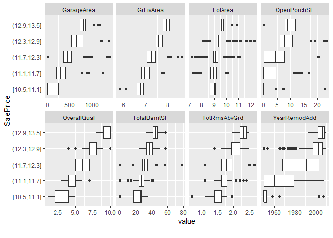

``` r
head(hpmodel)
```

    ##   GarageArea  LotArea TotRmsAbvGrd Neighborhood OpenPorchSF YearRemodAdd
    ## 1        548 9.041922     2.079442            1    7.810250         2003
    ## 2        460 9.169518     1.791759            1    0.000000         1976
    ## 3        608 9.328123     1.791759            1    6.480741         2002
    ## 4        642 9.164296     1.945910            1    5.916080         1970
    ## 5        836 9.565214     2.197225            2    9.165151         2000
    ## 6        480 9.554993     1.609438            0    5.477226         1995
    ##   GrLivArea TotalBsmtSF OverallQual CentralAir SalePrice
    ## 1  7.444249    29.25748           7          1  12.24769
    ## 2  7.140453    35.52464           6          1  12.10901
    ## 3  7.487734    30.33150           7          1  12.31717
    ## 4  7.448334    27.49545           7          1  11.84940
    ## 5  7.695303    33.83785           8          1  12.42922
    ## 6  7.216709    28.21347           5          1  11.87060

Although still not great, the transformed variables help alleviate some
of the issues that outliers were causing. Things look a lot more even.
We can see a more clear trend among the transformed predictors than
before.

Part c)
-------

``` r
## Multiregression with data hpmodel
# hpregmod is the regression model

hpregmod <- lm(SalePrice ~ CentralAir + GarageArea + GrLivArea + Neighborhood + OpenPorchSF + OverallQual + LotArea + TotalBsmtSF + TotRmsAbvGrd + YearRemodAdd, data = hpmodel)
summary(hpregmod)
```

    ## 
    ## Call:
    ## lm(formula = SalePrice ~ CentralAir + GarageArea + GrLivArea + 
    ##     Neighborhood + OpenPorchSF + OverallQual + LotArea + TotalBsmtSF + 
    ##     TotRmsAbvGrd + YearRemodAdd, data = hpmodel)
    ## 
    ## Residuals:
    ##      Min       1Q   Median       3Q      Max 
    ## -1.54017 -0.07126  0.01408  0.08630  0.51527 
    ## 
    ## Coefficients:
    ##                 Estimate Std. Error t value Pr(>|t|)    
    ## (Intercept)    2.944e+00  5.178e-01   5.686 1.57e-08 ***
    ## CentralAir1    1.738e-01  1.731e-02  10.041  < 2e-16 ***
    ## GarageArea     2.064e-04  2.413e-05   8.556  < 2e-16 ***
    ## GrLivArea      3.615e-01  2.536e-02  14.258  < 2e-16 ***
    ## Neighborhood2  2.006e-01  1.739e-02  11.534  < 2e-16 ***
    ## Neighborhood1  9.409e-02  1.061e-02   8.872  < 2e-16 ***
    ## OpenPorchSF    1.391e-03  9.150e-04   1.520    0.129    
    ## OverallQual    8.501e-02  4.932e-03  17.237  < 2e-16 ***
    ## LotArea        1.011e-01  8.878e-03  11.390  < 2e-16 ***
    ## TotalBsmtSF    5.916e-03  6.313e-04   9.371  < 2e-16 ***
    ## TotRmsAbvGrd  -4.680e-02  2.909e-02  -1.609    0.108    
    ## YearRemodAdd   2.316e-03  2.492e-04   9.294  < 2e-16 ***
    ## ---
    ## Signif. codes:  0 '***' 0.001 '**' 0.01 '*' 0.05 '.' 0.1 ' ' 1
    ## 
    ## Residual standard error: 0.1511 on 1448 degrees of freedom
    ## Multiple R-squared:  0.8581, Adjusted R-squared:  0.857 
    ## F-statistic: 795.8 on 11 and 1448 DF,  p-value: < 2.2e-16

``` r
# Illustrates the effect of the different levels of CentralAir and Neighborhood more clearly 
effect("CentralAir",hpregmod, xlevels = 2)
```

    ## 
    ##  CentralAir effect
    ## CentralAir
    ##        0        1 
    ## 11.86160 12.03536

``` r
effect("Neighborhood",hpregmod, xlevels = 3)
```

    ## 
    ##  Neighborhood effect
    ## Neighborhood
    ##        0        2        1 
    ## 11.97586 12.17644 12.06994

At first glance, we have statistical significance at the 5% level for
all of our variables except TotRmsAbvGrd and the OpenPorchSF. This is
quite interesting because that tells us there is no significant evidence
that the amount of rooms in your house or porch size affects the sale
price. My intuition initially told me there would be a correlation.

All other variables are statistically significant as of now;

CentralAir1 has an estimate of .173, which means that we can expect an
increase in sales price of around 18.89% if there is a a central air
conditioning unit in the house.

GarageArea has a coefficient of .000206, which means that for every 1
square foot increase in garage size, we can expect on average a .021%
increase in sales price.

GrLivArea has a coefficient of .362, which means that for every 1%
increase in above grade living area square footage, we can expect on
average a .362% increase in sales price.

Neighborhood1 has a coefficient of .0941 which means that we can expect
an increase in sales price of around 9.867% if the house lies in the
areas designated as Group 1.

Likewise, Neighborhood2 has a coefficient of .2006, which means that we
can expect an increase in sales price of around 22.21% if the house lies
in the areas designated as Group 2.

OverallQual has an estimate of .0851, which means that for every 1
increase in rating for the house’s quality, we can expect an increase of
8.88% in the house’s sale price.

LotArea has an estimate of .1011, which means that for every 1% increase
in lot area square footage, we can expect an increase in sales price of
around .1011%.

TotalBsmtSF has an estimate of .00592, which means that for every
square-root of square-foot increase that is equivalent to a one
square-foot increase in total basement square footage, we can expect an
increase in sales price of around .594%. (If TotalBsmtSF went from 1
square-foot to 4 square-foot; i.e. A square-root of square-foot from 1
to 4, it would equate to a increase in sales price of around .594%).

YearRemodAdd has an estimate of .00232, which means that for every year
later the house has been constructed/remodelled we can expect an
increase in around .232% in sales price.

Part d)
-------

``` r
## Plot of the residuals
plot(hpregmod$residuals, pch=20, ylim=c(-2,.7), xlim = c(0,1450))
abline(h=0, lwd=2, col = "blue")
```

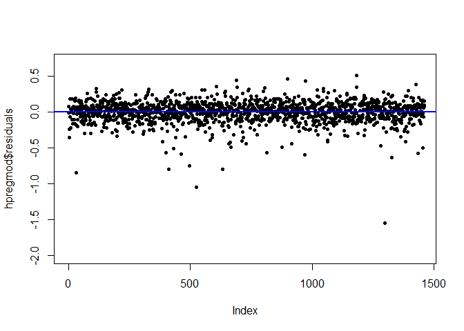

``` r
# Using the Jarque-Bera test to see if our residuals resemble a normal distribution
jarque.bera.test(hpregmod$residuals)
```

    ## 
    ##  Jarque Bera Test
    ## 
    ## data:  hpregmod$residuals
    ## X-squared = 9030, df = 2, p-value < 2.2e-16

Visually, our residual plot clearly shows some outliers that are
extremely far from the rest of the residuals. Running the Jarque-Bera
test, we can see that our x-squared is 9030 and our p-value is nearly 0,
indicating our residuals do **not** resemble a normal distribution. We
should find and eliminate outliers.

``` r
# Find influential outliers using Cook's Distance
influencePlot(hpregmod)
```

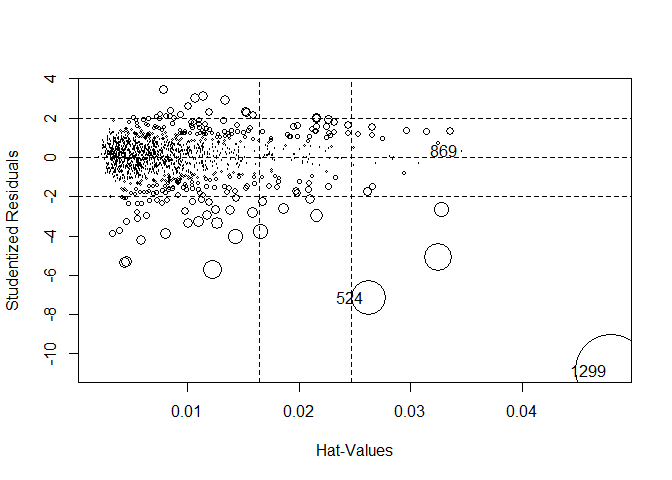

    ##          StudRes        Hat        CookD
    ## 524   -7.1535181 0.02617581 0.1107858720
    ## 869    0.3204562 0.03462686 0.0003071449
    ## 1299 -10.8630780 0.04795906 0.4583444742

``` r
cooksd <- cooks.distance(hpregmod)
plot(cooksd)
abline(h = 4/(nrow(hpmodel)-11), col = "red")
text(x=1:length(cooksd)+1, y=cooksd, labels=ifelse(cooksd>4/(nrow(hpmodel)-11), names(cooksd),""), col="red")
```

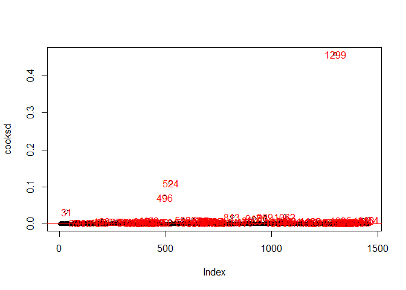

``` r
# Removing influential outliers using threshold of 4/N-k-1
influential <- as.numeric(names(cooksd)[(cooksd > 4/(nrow(hpmodel)-11))])
# New data set without outliers
hpmodeladj.screen <- hpmodel[-c(influential),] 
```

Here we eliminate some influential outliers using Cook’s Distance and we
will re-run the regression and take a look at residuals.

``` r
## Multiregression with data screened for outliers; data = hpmodeladj.screen
# hpregmod.screen is the regression model

hpregmod.screen <- lm(SalePrice ~ CentralAir + GarageArea + GrLivArea + Neighborhood + OpenPorchSF + OverallQual + LotArea + TotalBsmtSF + TotRmsAbvGrd + YearRemodAdd, data = hpmodeladj.screen)
summary(hpregmod.screen)
```

    ## 
    ## Call:
    ## lm(formula = SalePrice ~ CentralAir + GarageArea + GrLivArea + 
    ##     Neighborhood + OpenPorchSF + OverallQual + LotArea + TotalBsmtSF + 
    ##     TotRmsAbvGrd + YearRemodAdd, data = hpmodeladj.screen)
    ## 
    ## Residuals:
    ##      Min       1Q   Median       3Q      Max 
    ## -0.36754 -0.06969  0.00665  0.07008  0.31129 
    ## 
    ## Coefficients:
    ##                 Estimate Std. Error t value Pr(>|t|)    
    ## (Intercept)    3.068e+00  3.896e-01   7.875 6.97e-15 ***
    ## CentralAir1    1.464e-01  1.492e-02   9.812  < 2e-16 ***
    ## GarageArea     2.224e-04  1.876e-05  11.855  < 2e-16 ***
    ## GrLivArea      3.639e-01  1.920e-02  18.951  < 2e-16 ***
    ## Neighborhood2  1.538e-01  1.302e-02  11.809  < 2e-16 ***
    ## Neighborhood1  7.079e-02  7.844e-03   9.024  < 2e-16 ***
    ## OpenPorchSF    3.080e-03  6.943e-04   4.435 9.94e-06 ***
    ## OverallQual    8.164e-02  3.737e-03  21.848  < 2e-16 ***
    ## LotArea        1.086e-01  6.672e-03  16.276  < 2e-16 ***
    ## TotalBsmtSF    7.736e-03  5.110e-04  15.137  < 2e-16 ***
    ## TotRmsAbvGrd  -6.566e-02  2.197e-02  -2.988  0.00285 ** 
    ## YearRemodAdd   2.225e-03  1.869e-04  11.908  < 2e-16 ***
    ## ---
    ## Signif. codes:  0 '***' 0.001 '**' 0.01 '*' 0.05 '.' 0.1 ' ' 1
    ## 
    ## Residual standard error: 0.1079 on 1353 degrees of freedom
    ## Multiple R-squared:  0.9121, Adjusted R-squared:  0.9113 
    ## F-statistic:  1276 on 11 and 1353 DF,  p-value: < 2.2e-16

``` r
# Illustrates the effect of the different levels of CentralAir and Neighborhood more clearly 
effect("CentralAir",hpregmod.screen, xlevels = 2)
```

    ## 
    ##  CentralAir effect
    ## CentralAir
    ##        0        1 
    ## 11.89906 12.04542

``` r
effect("Neighborhood",hpregmod.screen, xlevels = 3)
```

    ## 
    ##  Neighborhood effect
    ## Neighborhood
    ##        0        2        1 
    ## 12.00144 12.15521 12.07223

Unsurprisingly, our adjusted R-squared went up with the removal of
influential outliers. Our model better fits this subset of data points.
The biggest change is our variable, TotRmsAbvGrd, suddenly became
statistically significant with the removal of influential outliers.

``` r
### Checking out the residuals for the screened model

## Plot of the residuals
plot(hpregmod.screen$residuals, pch=20, ylim=c(-.5,.5), xlim = c(0,1450))
abline(h=0, lwd=2, col = "blue")
```

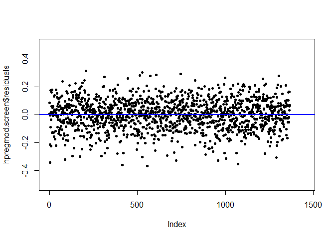

``` r
# Using the Jarque-Bera test we can see if our residuals overall look good.
jarque.bera.test(hpregmod.screen$residuals)
```

    ## 
    ##  Jarque Bera Test
    ## 
    ## data:  hpregmod.screen$residuals
    ## X-squared = 20.56, df = 2, p-value = 3.431e-05

Our residual plot looks a lot better with the removal of influential
outliers; this is enforced by our Jarque-Bera test results of a
x-squared of 20.56, which is dramatically less than before. Although not
perfect, we will run with it for now.

### Part e)

``` r
## Mallows Cp test for which terms to keep in model
ss = regsubsets(SalePrice ~ CentralAir + GarageArea + GrLivArea + Neighborhood + OpenPorchSF + OverallQual + LotArea + TotalBsmtSF + TotRmsAbvGrd + YearRemodAdd, method=c("exhaustive"), nbest = 3, nvmax = 19, data = hpmodeladj.screen)

subsets(ss,min.size = 8, statistic="cp", legend=interactive())
```

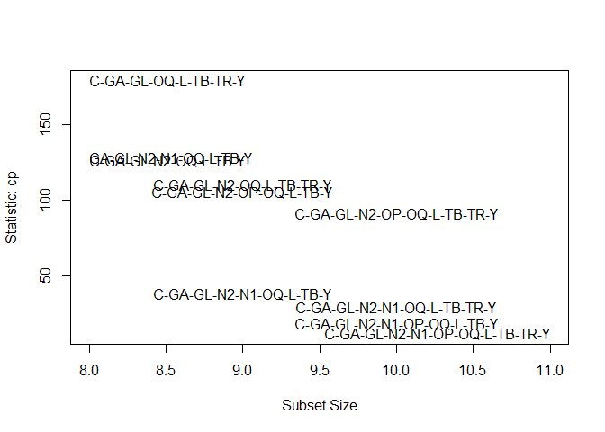

    ##               Abbreviation
    ## CentralAir1              C
    ## GarageArea              GA
    ## GrLivArea               GL
    ## Neighborhood2           N2
    ## Neighborhood1           N1
    ## OpenPorchSF             OP
    ## OverallQual             OQ
    ## LotArea                  L
    ## TotalBsmtSF             TB
    ## TotRmsAbvGrd            TR
    ## YearRemodAdd             Y

Seems that the complete model is the one to keep as it has the lowest cp
score.

``` r
## Testing for multicollinearity, 1 is none, 1<x<5 is moderate >5 is high, we will go with 4 here

vif(hpregmod.screen)
```

    ##                  GVIF Df GVIF^(1/(2*Df))
    ## CentralAir   1.114122  1        1.055520
    ## GarageArea   1.705320  1        1.305879
    ## GrLivArea    4.441703  1        2.107535
    ## Neighborhood 2.027086  2        1.193213
    ## OpenPorchSF  1.313897  1        1.146253
    ## OverallQual  2.883241  1        1.698011
    ## LotArea      1.333134  1        1.154614
    ## TotalBsmtSF  1.458933  1        1.207863
    ## TotRmsAbvGrd 3.373197  1        1.836627
    ## YearRemodAdd 1.681236  1        1.296625

Since GrLivArea’s GVIF = 4.44, we are going to remove that variable due
to multicollinearity.

``` r
## Multiregression with variable GrLivArea removed
# hpregmod.screen2 is the new regression model

hpregmod.screen2 <- lm(SalePrice ~ CentralAir + GarageArea + Neighborhood + OpenPorchSF + OverallQual + LotArea + TotalBsmtSF + TotRmsAbvGrd + YearRemodAdd, data = hpmodeladj.screen)
summary(hpregmod.screen2)
```

    ## 
    ## Call:
    ## lm(formula = SalePrice ~ CentralAir + GarageArea + Neighborhood + 
    ##     OpenPorchSF + OverallQual + LotArea + TotalBsmtSF + TotRmsAbvGrd + 
    ##     YearRemodAdd, data = hpmodeladj.screen)
    ## 
    ## Residuals:
    ##      Min       1Q   Median       3Q      Max 
    ## -0.45523 -0.07819  0.00184  0.07912  0.39573 
    ## 
    ## Coefficients:
    ##                Estimate Std. Error t value Pr(>|t|)    
    ## (Intercept)   5.084e+00  4.215e-01  12.063  < 2e-16 ***
    ## CentralAir1   1.454e-01  1.677e-02   8.671  < 2e-16 ***
    ## GarageArea    2.584e-04  2.099e-05  12.313  < 2e-16 ***
    ## Neighborhood2 1.729e-01  1.460e-02  11.847  < 2e-16 ***
    ## Neighborhood1 8.055e-02  8.802e-03   9.151  < 2e-16 ***
    ## OpenPorchSF   4.952e-03  7.728e-04   6.408 2.03e-10 ***
    ## OverallQual   9.897e-02  4.074e-03  24.295  < 2e-16 ***
    ## LotArea       1.181e-01  7.482e-03  15.779  < 2e-16 ***
    ## TotalBsmtSF   8.389e-03  5.733e-04  14.632  < 2e-16 ***
    ## TotRmsAbvGrd  2.533e-01  1.588e-02  15.944  < 2e-16 ***
    ## YearRemodAdd  2.123e-03  2.100e-04  10.106  < 2e-16 ***
    ## ---
    ## Signif. codes:  0 '***' 0.001 '**' 0.01 '*' 0.05 '.' 0.1 ' ' 1
    ## 
    ## Residual standard error: 0.1213 on 1354 degrees of freedom
    ## Multiple R-squared:  0.8887, Adjusted R-squared:  0.8879 
    ## F-statistic:  1081 on 10 and 1354 DF,  p-value: < 2.2e-16

``` r
# Illustrates the effect of the different levels of CentralAir and Neighborhood more clearly 
effect("CentralAir",hpregmod.screen2, xlevels = 2)
```

    ## 
    ##  CentralAir effect
    ## CentralAir
    ##        0        1 
    ## 11.89993 12.04538

``` r
effect("Neighborhood",hpregmod.screen2, xlevels = 3)
```

    ## 
    ##  Neighborhood effect
    ## Neighborhood
    ##        0        2        1 
    ## 11.99648 12.16942 12.07702

``` r
### hpregmod.screen2
```

### Part f)

``` r
### Checking out the residuals for the new screened model

## Plot of the residuals
plot(hpregmod.screen2$residuals, pch=20, ylim=c(-.5,.5), xlim = c(0,1400))
abline(h=0, lwd=2, col = "blue")
```

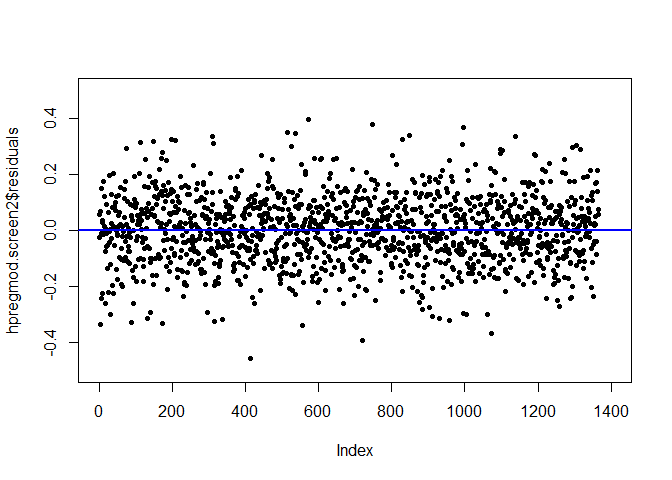

``` r
# Using the Jarque-Bera test we can see if our residuals overall look good.
jarque.bera.test(hpregmod.screen2$residuals)
```

    ## 
    ##  Jarque Bera Test
    ## 
    ## data:  hpregmod.screen2$residuals
    ## X-squared = 5.9, df = 2, p-value = 0.05234

The residual plot looks good, evenly distributed across all ranges.
Lower X-squared in the Jarque-Bera test as well and a p-value \> .05

### Part g)

``` r
### Determine which model is better (screen or screen2)
## Akaike Information Criterion (AIC), the smaller the value of AIC, the better

AIC(hpregmod.screen, hpregmod.screen2)
```

    ##                  df       AIC
    ## hpregmod.screen  13 -2191.379
    ## hpregmod.screen2 12 -1872.021

Our original model hpregmod.screen is actually preferred over the model
with GrLivArea removed.

``` r
### Determine which model is better (screen or screen2)
## Bayesian Information Criterion (BIC), the smaller the better

BIC(hpregmod.screen, hpregmod.screen2)
```

    ##                  df       BIC
    ## hpregmod.screen  13 -2123.533
    ## hpregmod.screen2 12 -1809.395

The BIC seems to agree with the AIC that our original model with no
variable taken out for multicollinearity is a better fit for the data.
This could be because the degree with which GrLivArea was multicollinear
wasn’t high enough to hinder the predictive power it added when it was
in the model. Since GrLivArea offered its own predictive capabilities,
AIC and BIC seem to think it makes the original model better even though
some multicollinearity may be involved.

### Part h)

``` r
## Multiregression with possible interaction variables
# hpregmod.screen is the base regression model we will use since we decided it was better than screens2


#squaring regression to determine possible significant interactions
hpregmod.screen.interactions <- lm(SalePrice ~ (CentralAir + GarageArea + GrLivArea + Neighborhood + OpenPorchSF + OverallQual + LotArea + TotalBsmtSF + TotRmsAbvGrd + YearRemodAdd)^2, data = hpmodeladj.screen)
anova(hpregmod.screen.interactions)
```

    ## Analysis of Variance Table
    ## 
    ## Response: SalePrice
    ##                             Df Sum Sq Mean Sq   F value    Pr(>F)    
    ## CentralAir                   1 15.527  15.527 1436.6041 < 2.2e-16 ***
    ## GarageArea                   1 71.403  71.403 6606.2384 < 2.2e-16 ***
    ## GrLivArea                    1 43.262  43.262 4002.5707 < 2.2e-16 ***
    ## Neighborhood                 2 14.625   7.312  676.5372 < 2.2e-16 ***
    ## OpenPorchSF                  1  1.777   1.777  164.3822 < 2.2e-16 ***
    ## OverallQual                  1  8.466   8.466  783.3058 < 2.2e-16 ***
    ## LotArea                      1  3.739   3.739  345.9369 < 2.2e-16 ***
    ## TotalBsmtSF                  1  2.770   2.770  256.3003 < 2.2e-16 ***
    ## TotRmsAbvGrd                 1  0.090   0.090    8.3400 0.0039423 ** 
    ## YearRemodAdd                 1  1.650   1.650  152.6712 < 2.2e-16 ***
    ## CentralAir:GarageArea        1  0.015   0.015    1.3943 0.2379038    
    ## CentralAir:GrLivArea         1  0.045   0.045    4.1449 0.0419613 *  
    ## CentralAir:Neighborhood      1  0.000   0.000    0.0015 0.9694648    
    ## CentralAir:OpenPorchSF       1  0.008   0.008    0.7857 0.3755700    
    ## CentralAir:OverallQual       1  0.011   0.011    1.0339 0.3094383    
    ## CentralAir:LotArea           1  0.020   0.020    1.8207 0.1774631    
    ## CentralAir:TotalBsmtSF       1  0.052   0.052    4.8212 0.0282881 *  
    ## CentralAir:TotRmsAbvGrd      1  0.008   0.008    0.7490 0.3869560    
    ## CentralAir:YearRemodAdd      1  0.004   0.004    0.3858 0.5346434    
    ## GarageArea:GrLivArea         1  0.112   0.112   10.3403 0.0013336 ** 
    ## GarageArea:Neighborhood      2  0.145   0.073    6.7079 0.0012640 ** 
    ## GarageArea:OpenPorchSF       1  0.000   0.000    0.0185 0.8917850    
    ## GarageArea:OverallQual       1  0.043   0.043    4.0069 0.0455214 *  
    ## GarageArea:LotArea           1  0.028   0.028    2.6207 0.1057200    
    ## GarageArea:TotalBsmtSF       1  0.002   0.002    0.2164 0.6418537    
    ## GarageArea:TotRmsAbvGrd      1  0.004   0.004    0.4093 0.5224183    
    ## GarageArea:YearRemodAdd      1  0.045   0.045    4.1181 0.0426289 *  
    ## GrLivArea:Neighborhood       2  0.191   0.095    8.8133 0.0001578 ***
    ## GrLivArea:OpenPorchSF        1  0.079   0.079    7.3250 0.0068892 ** 
    ## GrLivArea:OverallQual        1  0.100   0.100    9.2526 0.0023987 ** 
    ## GrLivArea:LotArea            1  0.002   0.002    0.2126 0.6448039    
    ## GrLivArea:TotalBsmtSF        1  0.019   0.019    1.7332 0.1882407    
    ## GrLivArea:TotRmsAbvGrd       1  0.000   0.000    0.0102 0.9195192    
    ## GrLivArea:YearRemodAdd       1  0.005   0.005    0.4243 0.5149067    
    ## Neighborhood:OpenPorchSF     2  0.056   0.028    2.5779 0.0763203 .  
    ## Neighborhood:OverallQual     2  0.011   0.005    0.4983 0.6076745    
    ## Neighborhood:LotArea         2  0.019   0.010    0.8869 0.4121606    
    ## Neighborhood:TotalBsmtSF     2  0.110   0.055    5.0693 0.0064118 ** 
    ## Neighborhood:TotRmsAbvGrd    2  0.066   0.033    3.0654 0.0469722 *  
    ## Neighborhood:YearRemodAdd    2  0.099   0.049    4.5609 0.0106209 *  
    ## OpenPorchSF:OverallQual      1  0.055   0.055    5.0913 0.0242117 *  
    ## OpenPorchSF:LotArea          1  0.000   0.000    0.0356 0.8504393    
    ## OpenPorchSF:TotalBsmtSF      1  0.054   0.054    4.9722 0.0259280 *  
    ## OpenPorchSF:TotRmsAbvGrd     1  0.004   0.004    0.3358 0.5623641    
    ## OpenPorchSF:YearRemodAdd     1  0.007   0.007    0.6047 0.4369435    
    ## OverallQual:LotArea          1  0.021   0.021    1.9059 0.1676608    
    ## OverallQual:TotalBsmtSF      1  0.185   0.185   17.1025 3.769e-05 ***
    ## OverallQual:TotRmsAbvGrd     1  0.002   0.002    0.1684 0.6815612    
    ## OverallQual:YearRemodAdd     1  0.000   0.000    0.0001 0.9930872    
    ## LotArea:TotalBsmtSF          1  0.011   0.011    0.9993 0.3176728    
    ## LotArea:TotRmsAbvGrd         1  0.005   0.005    0.4801 0.4884798    
    ## LotArea:YearRemodAdd         1  0.027   0.027    2.5001 0.1140805    
    ## TotalBsmtSF:TotRmsAbvGrd     1  0.005   0.005    0.4213 0.5163844    
    ## TotalBsmtSF:YearRemodAdd     1  0.022   0.022    2.0063 0.1568855    
    ## TotRmsAbvGrd:YearRemodAdd    1  0.000   0.000    0.0015 0.9687182    
    ## Residuals                 1300 14.051   0.011                        
    ## ---
    ## Signif. codes:  0 '***' 0.001 '**' 0.01 '*' 0.05 '.' 0.1 ' ' 1

``` r
# Illustrates the effect of the different levels of CentralAir and Neighborhood more clearly 
effect("CentralAir",hpregmod.screen.interactions, xlevels = 2)
```

    ## NOTE: CentralAir is not a high-order term in the model

    ## 
    ##  CentralAir effect
    ## CentralAir
    ##        0        1 
    ## 11.87654 12.02795

``` r
effect("Neighborhood",hpregmod.screen.interactions, xlevels = 3)
```

    ## NOTE: Neighborhood is not a high-order term in the model

    ## 
    ##  Neighborhood effect
    ## Neighborhood
    ##        0        2        1 
    ## 11.99508 12.01985 12.06977

Based off this summary, I would drop all interaction effects except
those with very low p-value. I will keep OverallQual:TotalBsmtSF,
GrLivArea:Neighborhood.

Therefore our new model will be built as such:

``` r
## Multiregression with selected interaction variables
# New model wil be renamed hpregmod.screen.interactions.selected


#squaring regression to determine possible significant interactions
hpregmod.screen.interactions.selected <- lm(SalePrice ~ CentralAir + GarageArea + GrLivArea + Neighborhood + OpenPorchSF + OverallQual + LotArea  + TotRmsAbvGrd + TotalBsmtSF + YearRemodAdd + (OverallQual*TotalBsmtSF) + (GrLivArea*Neighborhood), data = hpmodeladj.screen)
summary(hpregmod.screen.interactions.selected)
```

    ## 
    ## Call:
    ## lm(formula = SalePrice ~ CentralAir + GarageArea + GrLivArea + 
    ##     Neighborhood + OpenPorchSF + OverallQual + LotArea + TotRmsAbvGrd + 
    ##     TotalBsmtSF + YearRemodAdd + (OverallQual * TotalBsmtSF) + 
    ##     (GrLivArea * Neighborhood), data = hpmodeladj.screen)
    ## 
    ## Residuals:
    ##      Min       1Q   Median       3Q      Max 
    ## -0.37401 -0.07012  0.00768  0.06991  0.31702 
    ## 
    ## Coefficients:
    ##                           Estimate Std. Error t value Pr(>|t|)    
    ## (Intercept)              3.428e+00  3.878e-01   8.840  < 2e-16 ***
    ## CentralAir1              1.591e-01  1.493e-02  10.658  < 2e-16 ***
    ## GarageArea               2.084e-04  1.864e-05  11.182  < 2e-16 ***
    ## GrLivArea                3.515e-01  1.983e-02  17.723  < 2e-16 ***
    ## Neighborhood2           -1.012e+00  3.079e-01  -3.286 0.001042 ** 
    ## Neighborhood1           -2.656e-01  1.702e-01  -1.560 0.118947    
    ## OpenPorchSF              3.081e-03  6.845e-04   4.502 7.32e-06 ***
    ## OverallQual              3.614e-02  9.996e-03   3.615 0.000311 ***
    ## LotArea                  1.027e-01  6.626e-03  15.494  < 2e-16 ***
    ## TotRmsAbvGrd            -6.538e-02  2.168e-02  -3.016 0.002609 ** 
    ## TotalBsmtSF              2.541e-04  1.668e-03   0.152 0.878927    
    ## YearRemodAdd             2.236e-03  1.842e-04  12.145  < 2e-16 ***
    ## OverallQual:TotalBsmtSF  1.361e-03  2.819e-04   4.827 1.54e-06 ***
    ## GrLivArea:Neighborhood2  1.525e-01  4.081e-02   3.736 0.000195 ***
    ## GrLivArea:Neighborhood1  4.649e-02  2.332e-02   1.994 0.046375 *  
    ## ---
    ## Signif. codes:  0 '***' 0.001 '**' 0.01 '*' 0.05 '.' 0.1 ' ' 1
    ## 
    ## Residual standard error: 0.1062 on 1350 degrees of freedom
    ## Multiple R-squared:  0.915,  Adjusted R-squared:  0.9141 
    ## F-statistic:  1038 on 14 and 1350 DF,  p-value: < 2.2e-16

``` r
# Illustrates the effect of the different levels of CentralAir and Neighborhood more clearly 
effect("CentralAir",hpregmod.screen.interactions.selected, xlevels = 2)
```

    ## 
    ##  CentralAir effect
    ## CentralAir
    ##        0        1 
    ## 11.87481 12.03394

``` r
effect("Neighborhood",hpregmod.screen.interactions.selected, xlevels = 3)
```

    ## NOTE: Neighborhood is not a high-order term in the model

    ## 
    ##  Neighborhood effect
    ## Neighborhood
    ##        0        2        1 
    ## 11.99471 12.08997 12.06671

At first glance, our model with interaction effects seem better because
of the higher adjusted R-squared. To be more rigorous in our conclusion,
we will test using the AIC and BIC.

``` r
AIC(hpregmod.screen, hpregmod.screen2, hpregmod.screen.interactions.selected)
```

    ##                                       df       AIC
    ## hpregmod.screen                       13 -2191.379
    ## hpregmod.screen2                      12 -1872.021
    ## hpregmod.screen.interactions.selected 16 -2231.947

``` r
BIC(hpregmod.screen, hpregmod.screen2, hpregmod.screen.interactions.selected)
```

    ##                                       df       BIC
    ## hpregmod.screen                       13 -2123.533
    ## hpregmod.screen2                      12 -1809.395
    ## hpregmod.screen.interactions.selected 16 -2148.445

As expected, the new model with interaction variables has a lower AIC
and BIC, indicating it is probably a better model for our data.

### Part i)

``` r
### 5-fold cross-validation test

## Define Training Control

set.seed(123)
train.control <- trainControl(method = "cv", number = 5)

## Train the model
hpregmod.screen.interactions.selected <- train(SalePrice ~., data = hpmodeladj.screen, method = "lm", trControl = train.control)

## Summarize the results
print(hpregmod.screen.interactions.selected)
```

    ## Linear Regression 
    ## 
    ## 1365 samples
    ##   10 predictor
    ## 
    ## No pre-processing
    ## Resampling: Cross-Validated (5 fold) 
    ## Summary of sample sizes: 1093, 1092, 1091, 1093, 1091 
    ## Resampling results:
    ## 
    ##   RMSE      Rsquared   MAE       
    ##   0.108398  0.9107137  0.08536791
    ## 
    ## Tuning parameter 'intercept' was held constant at a value of TRUE

Based of the 5-fold cross-validation test, with a low RMSE and low MAE
and high R-squared, the model performed well.

``` r
##### Transforming Test dataset and using model from training to predict test SalePrice.
## load test dataset
housepricemodel_test <- read.table("C:/Users/Matt/Downloads/test.csv", header=TRUE, sep = ",")


## keep variables desired
hpmodeltest <- subset(housepricemodel_test, select = c("GarageArea", "LotArea", "TotRmsAbvGrd", "Neighborhood", "OpenPorchSF", "YearRemodAdd", "GrLivArea", "TotalBsmtSF", "OverallQual", "CentralAir"))

### Change categorical variables to factor variables for - Neighborhood, CentralAir

## Analyzing Neighborhood vs price to see if I can simplify the variable into bins/fewer parts
Neighborhood.id <- revalue(hpmodeltest$Neighborhood, c("Blmngtn" = "1", "Blueste" = "2", "BrDale" = "3", "BrkSide" = "4", "ClearCr" = "5", "CollgCr" = "6", "Crawfor" = "7", "Edwards" = "8", "Gilbert" = "9", "IDOTRR" = "10", "MeadowV" = "11", "Mitchel" = "12", "NAmes" = "13", "NoRidge" = "14", "NPkVill" = "15", "NridgHt" = "16", "NWAmes" = "17", "OldTown" = "18", "SWISU" = "19", "Sawyer" = "20", "SawyerW" = "21", "Somerst" = "22", "StoneBr" = "23", "Timber" = "24", "Veenker" = "25"))

## CentralAir
hpmodeltest$CentralAir <- revalue(hpmodeltest$CentralAir, c("N" = "0", "Y" = "1"))

### Change variables to factor
Neighborhood.id<- as.factor(Neighborhood.id)
hpmodeltest$CentralAir <- as.factor(hpmodeltest$CentralAir)

#### Assigning Group to Neighborhood.id

hpmodeltest$Neighborhood <- revalue(Neighborhood.id, c("1" = "0", "2" = "0", "3" = "0", "4" = "0", "5" = "1", "6" = "1", "7" = "1", "8" = "0", "9" = "1", "10" = "0", "11" = "0", "12" = "0", "13" = "0", "14" = "2", "15" = "0", "16" = "2", "17" = "0", "18" = "0", "19" = "0", "20" = "0", "21" = "0", "22" = "1", "23" = "2", "24" = "1", "25" = "1"))

### Change variables to factor
hpmodeltest$Neighborhood <- as.factor(hpmodeltest$Neighborhood)

#### Transformations performed on the test model (linear transformations not listed (no code needed))

## Applying the log transformation to GrLivArea
hpmodeltest$GrLivArea <- log(hpmodeltest$GrLivArea)
## Applying the sqrt transformation to OpenPorchSF
hpmodeltest$OpenPorchSF <- sqrt(hpmodeltest$OpenPorchSF)
## Applying the sqrt transformation to TotalBsmtSF
hpmodeltest$TotalBsmtSF <- sqrt(hpmodeltest$TotalBsmtSF)
## Applying the log transformation to TotRmsAbvGrd
hpmodeltest$TotRmsAbvGrd <- log(hpmodeltest$TotRmsAbvGrd)
## Applying the log transformation to LotArea
hpmodeltest$LotArea <- log(hpmodeltest$LotArea)


## Test set prediction
prediction <- predict(hpregmod.screen.interactions.selected, newdata = hpmodeltest)
SalePrice.prediction <- exp(prediction)
summary(SalePrice.prediction)
```

    ##    Min. 1st Qu.  Median    Mean 3rd Qu.    Max. 
    ##   49798  128759  160065  177829  210648  697054

List of predicted house sale price based on model built from training
set.
